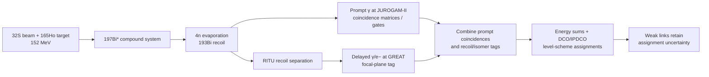

# 2026-10-09 DAY10 — 电磁比值与集体模式判别

## Run state

- checkpoint-002 已由同一 session 在 2026-10-10 00:17:56+08:00 观察并确认；距硬截止约 882 分钟。receipt 仍为 running，course state 未推进；Day11 仅保留 partial 预习，Day12 未打开。
- 最新 runtime 复核：2026-10-10 02:27:38+08:00，距离原硬截止约 752 分钟；run-local clock PID 222884 仍存活。研究继续，不修改 day_index/course state。

- run_id: `2026-10-09-day-10-01`; run_date: `2026-10-09`; day_index: `10`; timezone: `Asia/Shanghai`
- schedule_id: `wiki-daily-learning`; session mode: `new-session-per-run`
- session_id: `01a11ffc-03bc-77e2-98ee-a227ea51f371`
- resume_command: `codex resume 01a11ffc-03bc-77e2-98ee-a227ea51f371 -C /workspace/wiki -s danger-full-access -a never`
- requested card: `电磁比值与集体模式判别`; 本次正式卡完成，DAY11 只作不计学分预习。
- completed_day_indices: [10]
- partial_day_indices: [11]
- Day 10 card audit: complete
- Day 10 状态：科学卡、报告、canonical knowledge、Day11续接提示和 closeout 均完成；Gitee `main` 已推送成功，课程状态推进到 Day11。
- 时间门快照：`2026-10-09 18:23:16+08:00`；硬截止 `2026-10-10 15:00:00+08:00`；尚余约 `1237` 分钟，符合继续一个 Day+1 预习的条件。
- 最新 closeout 时间：2026-10-10 14:56:32+08:00；同一 session 完成，硬截止前收束；checkpoint-003 已登记/复核，没有新建 session 或重启 daemon。

### Day 10 card completion audit

| Day-matrix deliverable | Evidence locator / artifact | Status |
|---|---|---|
| 来源前独立回忆并标记 primed | [recall-record.md](20261009-DAY10-electromagnetic-ratios-collective-modes-run-01/recall-record.md)；LKH82-1、MU07-5、GR18-1 | complete |
| 阅读 MU07 主线并核 Table I、Figs.1–4 与 TAC/RPA 解释 | [MU07 source page](../../knowledge/sources/mukhopadhyay-2007-135nd-chiral-vibration-static.md) MU07-1、MU07-2、MU07-3、MU07-4、MU07-6、MU07-15；printed 172501-2 Table I、printed 172501-3 Figs.2–3、printed 172501-4 discussion；raw SHA-256 与 source 页一致 | complete |
| 对 Band A/B 制作匹配自旋 `B(M1)`、`B(E2)` 与比值表 | 本报告 “Theory/analysis exercise”；MU07-5、MU07-7、MU07-14 | complete |
| 检查带间/带内值、条件率换算和 line-identity 歧义 | 本报告 “Theory/analysis exercise”；MU07-8、MU07-10、MU07-11、MU07-13、MU07-16、ZH03-3、ZH03-4、LV19-9 | complete |
| 至少一个相似趋势的非目标机制与必要伴随量 | 本报告 “Counter-evidence and missing companion observables”；MU08-1、MU08-2、MU08-3、MU08-4、SU08-7、SU08-8、SU08-13、GR18-1、GR18-3、GR18-4、LKH82-1 | complete |
| 写成可复用 mode-discrimination card 并保留 review 状态 | [canonical synthesis](../../knowledge/synthesis/chirality-wobbling-competition-evidence.md)，anchor `### `135Nd` 电磁比值判别卡（DAY10）`；source locators 见唯一 writeback block | complete |

Day9 中的 Day10 预习只用于 priming；本次先独立回忆、再重新核对原文，因此 DAY10 学分只记在本次运行。DAY11 只保留在 `partial_day_indices`，不完成该卡审计、不推进课程状态越过 Day11，也未打开 Day12。

## Candidate pool and selection

后续检视已把 128Cs 标签候选推进到带级：Koike 2003 图1/4标出 yrast Y、side S、linking L；Chen 2017 能级图在重叠自旋处 A 低于 B，支持 A≈yrast、B≈side。Koike Table VII 的五条 linking transition 也有逐线自旋和 DCO，但这些 2003 link 不能自动绑定 2006 DSAM Fig.4 的每个 B 值点。当前剩余信息增益是跨 campaign 的 2006 branch/B 点逐线 crosswalk；若原文没有逐线 strength 表，将保留为有界缺口。

checkpoint-012 候选池刷新（2026-10-10 14:37:39+08:00；距硬截止约22分钟；closeout-only）：

| 槽位 | 最新状态与 locator | 剩余信息增益 |
|---|---|---|
| continuity：135Nd MU07 | MU07/ZH03/LV19 的公开能级与 transition crosswalk 已交叉；仍缺能把图点绑定到事件门和分支账本的门条件、响应与联合 covariance（MU07-5/6/8/10/11/13/15/16；ZH03-3/4；LV19-9）。 | 只有逐事件谱、branch ledger 或 response/covariance 能消除带间 B 点身份歧义；本轮没有这些输入。 |
| novelty：128Cs | Koike04/Hamamoto11 的 A 规则属同一模型链，规则相容不要求手征几何；Koike03 五条 link 可逐线定位，但 GR06 Fig.4 strength marker 只有部分图级对应，A 标签未测（KOIKE04-4/5；HM11-8；KOIKE03-6；GR06-9/10）。 | 需完整逐线绝对 B、混合比和态映射；再次拟合同一数据或增读衍生模型的边际信息低。 |
| counter-check：126Cs | Wang05/Wang06 共用 Komatsubara NORDBALL 数据；Grodner11 是独立 Warsaw/OSIRIS II DSA，但其 pure-M1 假设引用 Wang06。两表 I=14–17 的分带线能匹配最大差 0.9 keV；Wang05 的 M1-A 方向转述冲突仍在（WS06-4/7/8；GR126-4/5/10；WS05-7；KOIKE04-4；HM11-8）。 | 当前量化问题已包括差分 δ 敏感性和 DSA Table 1/2 B 值商复算；剩余缺口是逐线 δ、branch covariance 与 16+ yrast 253-keV 分支末态。 |
| 134Pr counter | PE06-2 是 branch-derived `Q0,1/Q0,2=2.0(4)`；Tonev07 公共机构 PDF 端点仍返回 HTTP 418，未用摘要作证据（PE06-2）。 | 需合法可读全文及可核验的独立 acquisition/line-level 数据。 |
| Day11 preview | 只复核现有方法页与 Herzáň 2015 source card：反应 `165Ho(32S,4n)`、152 MeV、JUROGAM-II/RITU/GREAT 及 prompt γ/recoil/isomer tagging（HE15-1）。Day11 保持 partial/uncredited。 | 已得到“反应/探测/门控影响观测强度归属”的方法边界；没有产额或 side-feeding 数值可更新 DAY10 比值。 |

当前选择仍为一个 continuity 问题（135Nd 线级强度身份）与一个非重叠 novelty 问题（128Cs 电磁规则/几何非唯一性）；126Cs 与 134Pr 作为所需的 counter-evidence 检查，不另开问题槽。完成一次 Day11 有界预习后，继续使用现有 126Cs source cards 做差分 mixing-ratio 敏感性分析；仅当直接线级 δ、branch covariance 或新增原始事件资料可得时，预期信息增益才会显著增加。

本轮先用 `knowledge/questions.md`、最近 DAY9/8 报告、Active handoff 和近期 source fingerprints 重建候选池。`knowledge/questions.md` 已有 `135Nd` 逐线 transition-identity 问题；Day9 已把该问题和相关 source 页作过预习写回，故本轮不重复创建问题，也不把这些预习算作正式交付。

| 槽位 | 候选 | 选择理由与范围 |
|---|---|---|
| continuity | `135Nd` MU07 Band A/B：同自旋带内强度、带间 out/in 和振动→静态模式解释 | 当前问题可能改变 `B(M1)/B(E2)` 趋势的证据强度及 line identity 置信度；直接复读 2007 原始 PDF 并检视 2019/2003 线表边界。 |
| novelty | `128Cs` GR18 bandhead `g` 因子与 TDPAD | 与 MU07 不同核素、不同实验量，可检验仅凭电磁指纹能否声称静态手征；只作比较控制，不转移结论。 |
| counter-evidence | `103,104Rh` Suzuki 2008 lifetime-derived ratio staggering | 能说明类似的 ratio 变化可由 E2 分母驱动；它不测 `135Nd`，且每核只覆盖候选双带一侧，故只作机制反例。 |

已检查但本轮不续开的候选：`131Ce` 的 mixing ratio/偏振缺口仍重要，但与 DAY10 两槽均无新交叉证据；`135Pr/187Au` wobbling 争议近期已有专门 source fingerprint，重复它们不会改善本卡的比值可识别性。完成 DAY10 后重建课程候选池，下一未完成卡是 DAY11；因此只预习其反应入口/在线谱学的一条有界路线，不开 Day12。

在 checkpoint-001 后另筛查了 MU07 自引的后续理论路线：Almehed, Dönau & Frauendorf, *Chiral vibrations in the A=135 region*, PRC 83, 054308 (2011), DOI [`10.1103/PhysRevC.83.054308`](https://doi.org/10.1103/PhysRevC.83.054308), arXiv [`0709.0969v2`](https://arxiv.org/abs/0709.0969v2)。Crossref、Scholar、arXiv 核实了题名/作者/版本关系；APS direct access probe 返回 403，paper-search 下载适配器拒绝绝对 `savePath` 并报告 path-traversal（未写入文件），随后从 arXiv PDF endpoint 直接取回到 `tmp/`，SHA-256 `becba964421bb8860fa657865071df117622a492a2bbb2b23d661d235296f29b`。对 PDF pp.1、8 的定向筛查看到它是理论 TAC+RPA 延伸，且 p.8 明说 `135Nd` 的 avoided-crossing 结果“not shown here, see [13]”；它不给新的 135Nd transition identity 或 branch data，故不作为新的实验反证/写回，不另建 source 页。该路线的边际信息增益不足以改变当前证据排序。

## Sources and evidence

### 同核补充对照：128Cs 实验、投影模型与 g 因子

### Hamamoto 2011：A 量子数选择规则的特殊模型

- Wiki source：[Hamamoto 2011 source page](../../knowledge/sources/hamamoto-2011-selection-rule-chiral-geometry.md)；DOI [10.1142/S0218301311017740](https://doi.org/10.1142/S0218301311017740)，arXiv [1102.0163v1](https://arxiv.org/abs/1102.0163v1)。Crossref 元数据核到作者、题名、IJMPE 20(2), 373–379；arXiv PDF SHA-256 dafe5f8f25081661413c5c8e2dc0b1d44a48c12ec4f5169bd1b06b0facd1c205。
- 全文主线、Table I、Figures 1–3 与 Eqs.(2)–(9) 已读；模型取 gamma=90°（Lund gamma=-30°）、同单-j 壳质子粒子/中子空穴，并以 h11/2 与限定的 M1 gyromagnetic factors 做数值例。转移规则和几何结果见 HM11-1–12。
- 作者称 128Cs、126Cs 电磁性质与该规则相容；同文将 134Pr 的带内 B(E2) 至少二倍差及 M1 规则违例列为不相容案例（HM11-13/14/15）。这些是作者对既有文献的比较，不是本文新测量；128Cs 输入引用 Grodner 2006（HM11-17）。
- 对 134Pr 反例回查现有 [Petrache et al. 2006 source page](../../knowledge/sources/petrache-2006-near-degenerate-chiral-misinterpretation.md)：该文由 measured in/out E2 branches 和 two-band mixing 得到 Q0,1/Q0,2=2.0(4)（PE06-2），与伙伴带形状/四极 collectivity 不等的方向一致。它是 Hamamoto 引用的既有分析，不能算独立复制；派生 Q0 比也不是 M1 selection-rule 违例的逐线复核。
- 规则的理论前身：[Koike, Starosta & Hamamoto 2004 source page](../../knowledge/sources/koike-2004-chiral-bands-selection-rules.md)；DOI [10.1103/PhysRevLett.93.172502](https://doi.org/10.1103/PhysRevLett.93.172502)，全文来自 [Tohoku repository record 5332](https://tohoku.repo.nii.ac.jp/records/5332)。Crossref/机构库核对题名、作者、PRL 93, 172502；四页 PDF SHA-256 f39816a5d2f3f3ec45098fc636371ee3e8e4dc721b0ced33e7c87b453b7f155e。Eqs.(1)–(10)、Figures 1–3 已读并检查图2/3；见 KOIKE04-1–13。
- 2004 与 2011 使用同一特殊粒子-转子 A 量子数路线；2004 明言该规则对模型本征态成立，不要求该态实际形成手征几何（KOIKE04-5）。因此“规则相容”是模型条件检查，不是观察到非共面几何；两个理论来源不能算作独立的实验复核。
- Hamamoto 引用的 Tonev et al. 2007 DOI [10.1103/PhysRevC.76.044313](https://doi.org/10.1103/PhysRevC.76.044313) 经 Crossref 核到作者/题名/PRC 76 元数据。arXiv 标题查询无匹配；Google Scholar 找到 University of Zagreb repository 的 PDF 链接，但 official landing 与 FILE0/download endpoint 均返回 HTTP 418。HAL API 仅提供记录/摘要字段，无可取得的 PDF file locator。没有保存全文，也未把摘要或搜索结果当作证据；该实验可能增加 lifetime/branch 对照，但数据依赖关系仍未核实。
- Wang et al. 2006 source page：[126Cs candidate doublet bands](../../knowledge/sources/wang-2006-126cs-candidate-chiral-doublet.md)；DOI [10.1103/PhysRevC.74.017302](https://doi.org/10.1103/PhysRevC.74.017302)，arXiv [nucl-ex/0702006v1](https://arxiv.org/abs/nucl-ex/0702006v1)，PDF SHA-256 88e8cc5625493de58e5d7b2ee88318e49c44183db7e2613009e344538954f536。它明确是 Komatsubara 同一 NORDBALL acquisition 的再分析；Table I 给 ADO/spin/intensity 线表，Fig.5 报 ratio staggering。未给 lifetime/absolute B；Wang05 thesis 与 Wang06 不可重复计数。
- 独立同位素比较：[王守宇 2005 thesis source page](../../knowledge/sources/wang-shouyu-2005-126cs-123i-chiral-thesis.md)。65-MeV 116Cd(14N,4n)/NORDBALL 实验约 8×10^8 符合事件；正宇称 Bands 1–2 的同自旋区 B(M1)/B(E2) 近似且有交错，作者以 PRM 支持候选解释（WS05-1/2/3/4）。这是独立于 128Cs campaign 的反应/探测系统，但呈现的是分支派生 ratio 与模型解释；没有逐线绝对 B 和 A 映射，不能直接验证 A 规则。该论文自己用 134Pr 作判据非普遍性反例（WS05-5）。
- 126Cs 的独立绝对强度来源：[Grodner et al. 2011 source page](../../knowledge/sources/grodner-2011-126cs-chiral-selection-rules.md)；DOI [10.1016/j.physletb.2011.07.062](https://doi.org/10.1016/j.physletb.2011.07.062)，Crossref 核到 Phys. Lett. B 703, 46–50，INSPIRE record 930155 提供 CC BY 3.0 Elsevier XML，SHA-256 dfc649e43493debee93c4d9e76694360972f82382ce0b25a04945b7a766b728c。其 120Sn(10B,4n)/OSIRIS II DSA campaign 报告 13 lifetimes 和 26 derived absolute B values（GR126-1/2/3/4/5）；Fig.3 caption/正文报告 interband B(M1) 交错与 inband 相反相位（GR126-6）。Figure image 未能从公开 XML 取到，未做像素读数；Bhat 2014 的 Ref.[18] 是同一实验，Wang 2005 thesis 则是不同反应/数组的另一路数据。

- 来源转述冲突：Wang 2005 printed p.123 / PDF p.133, Sec.4.3 对其 Ref.[34] Koike 2004 的 M1 规则写成同 A 较易、异 A 禁止（WS05-7）；Koike 2004 Eq.(6)/printed 172502-2 说同 A M1 约弱一个数量级（KOIKE04-4），Hamamoto 2011 Eq.(7)同向（HM11-8）。引用题名/作者/年份对应无误；差异原因未解决。

- 长文理论来源：[Rohoziński et al. 2011 EPJA source page](../../knowledge/sources/rohozinski-2011-cphc-s-symmetry-chirality.md)；DOI [10.1140/epja/i2011-11090-7](https://doi.org/10.1140/epja/i2011-11090-7)，Crossref 核到题名、作者、EPJA 47 article 90；Springer PDF 为 CC BY-NC，SHA-256 94b2b3bc89c1d942f07f7c512c5aecc38c3cc08bbf48dac507ad373ace64b8c9。全文15页、Fig.5–11、12–13、24–25选择性视觉检查，Eqs.(1)–(31)主线已读（CPHC11-1–13）；该文是Acta短文的后续理论工作，未加入新实验。
- 理论机制补充：[Prochniak et al. 2011 source page](../../knowledge/sources/prochniak-2011-cphc-s-symmetry-transition-rules.md)；DOI [10.5506/aphyspolb.42.465](https://doi.org/10.5506/aphyspolb.42.465)，Acta Physica Polonica B full text。Crossref 核到 authors/volume/issue/page，保留 PDF SHA-256 `38086d08899d60b4b400be263ec600596c0ca971e339ff5cde1d9d13c9e052cd`（按本地原文复算并校正 frontmatter）；全文 5 页、Eqs.(1)–(9) 与 Fig.1 已读/查看（PS11-1–11）。它定义的 S=PαCπν 是形变空间 alpha-parity 与质子/中子交换，不等于 Koike 的 A 算符。
- 理论反解释：[Grodner 2011 source page](../../knowledge/sources/grodner-2011-bm1-staggering-structural-composition.md)；DOI [10.1142/S0218301311017752](https://doi.org/10.1142/S0218301311017752)，arXiv [1101.5907v1](https://arxiv.org/abs/1101.5907v1)，PDF SHA-256 716faa155028c0a6f6e34faca638c9ca76ec98ee7c69642a3d8186eb98190d67。全文 7 页、Eqs.(1)–(27) 已读，无实验表/新测量；R_yT、相位约定和带内/带间矩阵元见 GRODNER11-1/2/3/4，关于组态/三轴芯条件及 135Nd、Rh 例子见 GRODNER11-5/6/7/8/9。Ref.[1]/[12] 分别回指 GR06 与 MU07（GRODNER11-10/11）。
- 扩展稿开放全文检查：Crossref 核验 World Scientific 的 2005 DOI 10.1142/S0218301305003107 和 2006 DOI 10.1142/S0218301306004508；Semantic Scholar/Unpaywall 标为 closed，Tohoku exact-DOI 查询无记录，World Scientific 公共摘要页返回 HTTP 403，Scholar 只返回出版商页面。OA-only 下载结果均为 oa_not_found，未将摘要当正文证据。
- 作者回顾材料只作来源线索：[NCBJ autoreferat](https://old.ncbj.gov.pl/sites/default/files/autoreferat_wersja_angielska.pdf) PDF p.18 Figure 12 重画 128Cs lifetime/B(M1) 趋势并称数据采于 2003 年末、交错出现后曾复核分析；它是同一作者对既有数据的回顾，不增加独立测量或逐线 B 表。

Koike 2003 Table VII 与 Grodner 2006 Figure 2 的 128Cs link energies 可交叉对应：508.9→509、532.0→532、621.6→622、571.1→571、638.6→638 keV，最大差 0.6 keV，符合后图按整数 keV 标注；对应的 side→yrast spins 一致。该核验支持五条 link 的跨 campaign 能级图映射，但 Grodner Fig.4 的 strength markers 没有逐点标注 Eγ，不能由此宣称每个 B(M1) 点都唯一绑定到一个 link（KOIKE03-6；GR06-9）。

- 原始纲图和 DCO 源：[Koike et al. 2003 source page](../../knowledge/sources/koike-2003-128cs-chiral-doublet-bands.md)；DOI [10.1103/PhysRevC.67.044319](https://doi.org/10.1103/PhysRevC.67.044319)，全文来自 Tohoku repository record 5352。Crossref、机构库和论文页眉/页脚核对到 PRC 67, 044319；PDF 首页 DOI 行却印有 0343XX 占位字符串，source 页保留此异常。反应/仪器见 KOIKE03-1，yrast/side/linking scheme 和 9+ isomer 归属见 KOIKE03-2/3，Table II/VI/VII 的 line identity 与 DCO/δ 见 KOIKE03-4/5/6，Y/S/L 图例见 KOIKE03-7。
- 对 Grodner 2006 Figure 4 做了不读像素数值的 line-class 核对：I=12/14/16 out-B(M1) 图点可按 L532/L571/L639 与 Table VII 候选匹配；I=13 的 622-keV 线在谱图标作 Y622/L622，身份仍不唯一；I=15 是上限箭头，I=11 的 L509 不在该 strength panel 的点列范围。故仅有部分 marker-to-line 交叉支持，未生成逐点 B 值表（GR06-10；KOIKE03-6）。

- 实验源：[Grodner et al. 2006 source page](../../knowledge/sources/grodner-2006-128cs-chiral-doublet-lifetimes.md)；DOI [10.1103/PhysRevLett.97.172501](https://doi.org/10.1103/PhysRevLett.97.172501)；机构库全文 [record 5385](https://tohoku.repo.nii.ac.jp/records/5385)。反应与 OSIRIS II/DSAM 输入链见 GR06-1/2，侧馈和纯 M1 假设见 GR06-3/5；derived B 值与 M1 staggering 见 GR06-4/6、printed 172501-2–3 Figure 4。
- 模型源：[Chen et al. 2017 source page](../../knowledge/sources/chen-2017-128cs-angular-momentum-projection-chirality.md)；DOI [10.1103/PhysRevC.96.051303](https://doi.org/10.1103/PhysRevC.96.051303)，arXiv [1708.07282v1](https://arxiv.org/abs/1708.07282v1)。Hamiltonian/projection 和固定形变输入见 CHEN17-1/2/3；transition strengths 复现及高自旋 B(E2) 偏移见 CHEN17-4/5；自旋相关 K/倾角几何见 CHEN17-6/7。Figure 2 使用 2006 Ref.[14] 数据，见 CHEN17-8。
- 与 [Grodner et al. 2018 g-factor source](../../knowledge/sources/grodner-2018-128cs-chiral-g-factor.md) 对读：GR18-1 是两个 TDPAD 测量给出的 bandhead g=+0.59(1)；GR18-3/4 中的近平面与 onset 是 PRM+CDFT 作者解释。此 g 因子不是高自旋模式几何的直接观测。
- 反证/边界：Chen 2017 不是独立实验复测，且固定形状使高自旋 B(E2) 模型趋势偏离；Grodner 2006 的绝对 B 值依赖 DSAM feeding/branch 输入与 pure-M1 假设。未把 A/B 与 yrast/side 标签未经核验地逐线合并，也没有用图像数字化制造精确 B 比值。

### 主来源：`135Nd` 的 MU07 DSAM 强度与 TAC+RPA

- Wiki source：[Mukhopadhyay et al. 2007](../../knowledge/sources/mukhopadhyay-2007-135nd-chiral-vibration-static.md)；DOI [`10.1103/PhysRevLett.99.172501`](https://doi.org/10.1103/PhysRevLett.99.172501)；官方 APS 页面 `https://journals.aps.org/prl/abstract/10.1103/PhysRevLett.99.172501`。
- raw PDF：`raw/papers/gpt/high-spin-20260920/三轴/手征/2007_Mukhopadhyay et al_From Chiral Vibration to Static Chirality in Nd 135.pdf`；SHA-256 `9eccc9c2ad02cc10735d1aad0d76eb2fd8af0a4acc814bcaab8099f50e748425`，与 source frontmatter 相同。Crossref DOI 查询匹配作者/年/期刊/卷；Google Scholar 的 MU07 搜索调用失败，未把它当证据。
- 原文主线：175-MeV `100Mo(40Ar,5n)`，Gammasphere 约 `2.5×10^9` 五重及以上符合事件；两带 lifetimes 由 angle-gated DSAM / LINESHAPE 与 SRIM stopping powers 提取（PDF pp.1–2、Fig.1、Table I）。Table I 从 lifetimes 派生带内 `B(M1)` 与 `B(E2)`；Figs.2–3 的图例分别标明 Band A、Band B、Band B→Band A 数据点及 TAC/RPA 曲线（MU07-4/5/6；printed 172501-2 Table I、printed 172501-3 Figs.2–3）。
- 实验事实与派生量分层：能级/带结构、角度依赖线形和寿命是实验链；B 值是从该链派生，不是直接计数。作者报告同自旋 Band A/B 带内 B 值近似相同。 lifetime 误差来自 χ² 最小值附近行为；没有另报 stopping/feeding 系统项与联合协方差（MU07-1/4/15）。
- 作者解释与模型：TAC 描述内带基线；RPA 给激发能分裂及带间跃迁。作者把低自旋区解释为 chiral vibration，把 RPA mode 变软并降至零后的 TAC 解解释为 static chirality，模型 onset 约在数据中双带最近点上方一个自旋单位（MU07-2/3；PDF pp.3–4）。图中数据点和计算曲线分开，不能把 RPA 曲线写成观测事实。
- 直接读图：四个 Band B→Band A 带间 E2 开圆点沿自旋上升；31/2−→33/2−、33/2−→35/2− 的端点敏感区间分离，35/2− 与 37/2− 区间重叠；图中无 39/2− interband 点。带间 M1 中心点非单调且数量级较小（MU07-8/13/15）。图估端点不具已声明的统计覆盖，不能当置信区间。

### 比较与反证来源

- `128Cs`：[Grodner et al. 2018 source](../../knowledge/sources/grodner-2018-128cs-chiral-g-factor.md)，DOI [`10.1103/PhysRevLett.120.022502`](https://doi.org/10.1103/PhysRevLett.120.022502)；raw SHA-256 `c71ec59160c444c34ab7f340db5f045c1f26456bc1741197ec62caea7f4efbf2` 与 source 页相符。两处 TDPAD 测量得 isomer `g=+0.59(1)`（GR18-1，PDF pp.1–3、Table I）。PRM+constrained-CDFT 以 `⟨ô⟩≈0.15` 将 bandhead 解释为近 planar，而不是理想 aplanar geometry；这是模型结论，不是 TDPAD 直接拍摄到几何（GR18-3/4，PDF pp.4–5、Fig.4）。
- Crossref 查询核实 GR18 DOI/题名；Google Scholar 找到 APS 记录，但摘要仅作发现入口，结论来自 raw PDF 与 GR18-1/3/4。该核素/反应/观测量与 MU07 不同，故作为机制比较而非独立复制 135Nd。
- `136Nd`：[Mukhopadhyay et al. 2008 source](../../knowledge/sources/mukhopadhyay-2008-136nd-transition-rates.md)，DOI [`10.1103/PhysRevC.78.034311`](https://doi.org/10.1103/PhysRevC.78.034311)；raw SHA-256 `ea77d7d033051369d19aad2f82a542e91e262eb490d518b246f7f04c2d0dcd2c` 与 source 页相同。`100Mo(40Ar,4n)` DSAM 的两条近简并负宇称带在 `I≈17ℏ` crossing 附近 B(E2) 仍相差约 2–3 倍；作者结合两套四准粒子组态及 crossing/band mixing 解释（MU08-1/2/3/4，PDF pp.4–6、Table II、Figs.3–5）。这提供同质量区的配置混合反例，但不是 MU07 的数据，也不是对 135Nd 的直接反证。
- `103,104Rh`：[Suzuki et al. 2008 source](../../knowledge/sources/suzuki-2008-lifetimes-103rh-104rh.md)，DOI [`10.1103/PhysRevC.78.031302`](https://doi.org/10.1103/PhysRevC.78.031302)。作者报告 `B(M1)` 随自旋下降，弱奇偶变化在 `B(E2)`，故先前看到的 `B(M1)/B(E2)` staggering 归因于 E2 分母（SU08-8）；每个核只测候选双带的一侧，且 `B(M1)` extraction 假设 pure M1 并采用先前 branching（SU08-7/13）。这是另一种可生成 ratio 变化的机制，不是 MU07 的直接反证。
- 比值与混合比方法：[Lange–Kumar–Hamilton 1982](../../knowledge/sources/lange-kumar-hamilton-1982-multipole-admixtures.md) LKH82-1，printed p.121 / PDF p.3 Eqs.2.1–2.6。crosswalk：[Zhu 2003](../../knowledge/sources/zhu-2003-135nd-composite-chiral-pair.md) ZH03-3 与 [Lv 2019](../../knowledge/sources/lv-2019-chirality-135nd-reexamined.md) LV19-9。后两者用于候选线身份和多极类别审查，不把各自数据倒灌为 MU07 的 B 值。
- 本轮重新校验并视觉查看 Zhu raw PDF printed p.4 / PDF p.4 Fig.2；SHA-256 `8dd7aaa0a2e369532dd673384bcc18c60abc330408f20243939b31df15d98542` 与 source 页相同。31/2− Band B 同一初态在图中有 648-keV ΔI=1 到 Band A 29/2−、896-keV ΔI=2 到 Band A 27/2−，以及 226-keV Band-B intraband 线；箭头粗细只是相对强度。图/正文保留 648/649 标签差异，且不提供绝对 B 或 Qt（ZH03-3/4/5）。因此初始自旋标记本身不能把 MU07 的 E2 图估点唯一绑定到其中一条 outgoing branch。

## Theory/analysis exercise

### B(M1) staggering 与结构条件的推导边界

Grodner 2011 取对称恢复态为 |IM,+⟩=(|IM,L⟩+|IM,R⟩)/√(2N+)、|IM,−⟩=i(|IM,L⟩−|IM,R⟩)/√(2N−)。在其 R_yT 相位约定且强手征极限下，带内跃迁振幅由左手态矩阵元的实部给出，带间振幅由虚部给出（Eqs.(17)–(27)）。它推出相应 partner 的 B 值可相等，同时说明 spin-dependent B(M1) staggering 还受奇粒子组态和三轴芯转动矩阵元支配。这个公式链是作者的模型/对称性分析，不是 128Cs 或 135Nd 的新实验几何测量。

### 跨 campaign 的 128Cs linking-line 核对

| Koike 2003 Table VII Eγ (keV) | Grodner 2006 Figure 2 标签 (keV) | Ji→Jf | 结果 |
|---:|---:|---|---|
| 508.9 | 509 | 11+→10+ | 匹配 |
| 532.0 | 532 | 12+→11+ | 匹配 |
| 621.6 | 622 | 13+→12+ | 匹配 |
| 571.1 | 571 | 14+→13+ | 匹配 |
| 638.6 | 638 | 16+→15+ | 匹配 |

最大取整差为 0.6 keV，支持跨 campaign 的五条 linking line identity；published B(M1) marker 与 Eγ 的逐点关联仍缺表格行，不能只依赖 band label 推断。

| 2006 out-B(M1) marker spin | 2003 Table VII candidate | 2006 Figure 4 line label | 判定 |
|---:|---|---|---|
| 12 | 532.0 keV, 12+→11+ | L532 | 图点/线类可配，B 数值仍只有图 |
| 13 | 621.6 keV, 13+→12+ | Y622/L622 | 同能量双标签，不能唯一配到 marker |
| 14 | 571.1 keV, 14+→13+ | L571 | 图点/线类可配，B 数值仍只有图 |
| 15 | Table VII 无对应行 | Figure 4 上限箭头 | 保留上限，不强配跃迁 |
| 16 | 638.6 keV, 16+→15+ | L639 | 图点/线类可配，B 数值仍只有图 |

Koike 2003 的 508.9-keV 11+→10+ link 在 Grodner Fig.4 line spectrum 标作 L509，但 out-B(M1) panel 没有对应 I=11 marker。以上只完成 line-class/spin 交叉检查，没有从 B 值曲线读出中心值或误差。

### 128Cs 同母态支路复算与 line-resolved 对照

Koike 2003 Table VII 的五条 side→yrast mixed ΔI=1 links 为：

| Eγ (keV) | Ji→Jf | gate | RDCO |
|---:|---|---|---:|
| 509 | 11+→10+ | 143 keV, 10+→9+ | 0.82(9) |
| 532 | 12+→11+ | 349 keV, 11+→10+ | 0.87(10) |
| 622 | 13+→12+ | 273 keV, 12+→11+ | 0.65(14) |
| 571 | 14+→13+ | 408 keV, 13+→12+ | 0.86(13) |
| 639 | 16+→15+ | 464 keV, 15+→14+ | 0.63(16) |

作为同母态复算，11+ yrast 的 348.6-keV 11+→10+ M1/E2 line 有相对强度 64.1，651.7-keV 11+→9+ E2 crossover 有相对强度 9.1。按 Koike Eq.(7)，λ=9.1/64.1=0.14197，采用 Eγ(MeV) 得 B(M1)/B(E2)=13.62 μN²/(e²b²)（忽略 δ²）；纳入 Table VI δ=-0.16 后为 13.28，变化约 2.50%。该比值是依赖同母态分支、跃迁能量和 mixing 的推导值，不是绝对 B 测量。原文仅给强、弱线相对强度误差范围 5–30%，没有逐行协方差，所以不据此报置信区间（KOIKE03-4/5/6/9）。

### 128Cs 补充证据链练习

| 项目 | 证据类别 | 这一项能支持什么 |
|---|---|---|
| 2006 Fig.4 B(E2)、B(M1) | DSAM 寿命与 Doppler-corrected branches 推得的强度；M1 分量采用纯 M1 假设 | 支持该双带具有相应 strength pattern；不是几何的直接观测 |
| 2017 Figs.3–4 K/倾角分布 | pairing-plus-quadrupole + angular-momentum-projection 计算 | 提供 I=11、14、18ℏ 的模型几何演化；不是新的实验确认 |
| 2018 bandhead g factor | TDPAD 测得的磁矩值；近 planar 来自 PRM+CDFT 拟合 | 给单个低自旋态的互补观测量；不能推出全带静态区间 |

这条交叉核验识别了 Figure 2 的数据复用：Chen 2017 Ref.[14] 对应 Grodner 2006。它不重算 2006 Fig.4 的中心值，因为原文没有逐线 B 值表；本报告不从绘图像素报告伪精确误差。可复用判断是 transition strengths 与模式模型相容，而几何结论需要独立观测量或注明模型适用条件。

先按 Table I 中心值直接相除，再对匹配自旋两带的 ratio 作 quotient-of-quotients。所有中心值来自同一 MU07 DSAM 链；表内不传播误差，因为没有联合协方差。

| `I` | Band A `B(M1)/B(E2)` | Band B `B(M1)/B(E2)` | Band B/A quotient-of-quotients |
|---|---:|---:|---:|
| 31/2− | 7.8125 | 9.6429 | 1.2343 |
| 33/2− | 6.8750 | 7.5000 | 1.0909 |
| 35/2− | 7.5000 | 7.8571 | 1.0476 |
| 37/2− | 5.3125 | 5.8621 | 1.1034 |
| 39/2− | 16.1538 | 17.2727 | 1.0693 |

`B(M1)` 以 `μN²`、`B(E2)` 以 `e²b²` 表示，故上述商单位为 `μN²/(e²b²)`。它不等于无量纲的同线 `δ²`。同一跃迁满足 `δ²=Tγ(E2)/Tγ(M1)=[0.835 Eγ(MeV)]²×B(E2)[e²b²]/B(M1)[μN²]`；须先确认同一线及其 `Eγ`。MU07 Table I 按初始自旋列寿命和 B 值，但没有逐行列 γ 能量/末态自旋，故这里不反解 `δ`（LKH82-1、MU07-11）。

39/2− 的两条中心商升至 `16.15` 与 `17.27`，主要受弱 E2 分母影响：把 Table I 的 `B±σ` 端点作矩形敏感性组合，得到 `11.25–24.0` 与 `11.43–27.5`，二者大幅重叠。它们不是置信区间，也没有联合协方差（MU07-14/15）。

另将 Figs.2–3 的图估带间点除以 Band B Table-I 同初始自旋带内中心值，可得维度消去的 B-strength out/in 商：

| `I` | `B(M1)out/B(M1)in` | `B(E2)out/B(E2)in` |
|---|---:|---:|
| 31/2− | ≈0.031 | ≈0.14 |
| 33/2− | ≈0.057 | ≈0.24 |
| 35/2− | ≈0.036 | ≈0.48 |
| 37/2− | ≈0.11 | ≈0.50 |

这些是图估的 B 值比，不是观测到的 photon-count branch。对同一多极，部分光子率还含 `Eγ^(2L+1)`。例如按 Zhu Fig.2 的 31/2− 候选 `648/226 keV` link、同一 Band B 母态和 M1 分量作条件换算：`Γγ,out/Γγ,in≈(648/226)^3×(0.084/2.7)≈0.73`。这是示范不同转移能会显著改变比值，不是实测计数比或完整支路比（MU07-8/10、ZH03-3）。

E2 转换更依赖 line class：31/2− 带间图点若被解释为 ΔI=1 mixed link 的 E2 分量，候选 Eγ 换算约 `27.3`；若对应 ΔI=2 E2 crossover，则约 `137.7`。两者都还假定 Table-I `B(E2)` 分母对应候选同带线；MU07 未绑定开圆点的具体线，LV19 只给较晚 campaign 的候选类别（MU07-10/11/16、LV19-9）。所以量级差异暴露可识别性问题，不构成真实 branching ratio 的双解测量。

`Q_t` 不是 B(E2) 列的直接读数：需要确定 E2 跃迁、能量、自旋/末态及适用的 `K` 或转子矩阵元。由于图估 E2 numerator 尚未唯一对应 ΔI=1 mixed-link E2 分量或 ΔI=2 crossover，本轮不报唯一 `Q_t`。

### Hamamoto 的 A 量子数规则：从模型推到可检验量

在本文特殊极限内，推理链为：

1. E2 只取集体芯项，质子/中子为旁观者，故需 delta-C=0；gamma=90° 时 delta-R3=0 的 E2 矩阵元消失，结合 E2 算符的投影选择给出非零跃迁要求 delta-A 非零（HM11-7）。
2. 对所选 M1 算符和 g 因子，质子—中子交换下近似反对称，模型因此预期 delta-A 非零的 B(M1) 强于 delta-A=0（HM11-8）。
3. 手征伙伴态在该构造中具有相反的 A 本征值；Figure 2(a) 把允许跃迁画成 E2 与较强 M1 类，Figure 2(b) 的近简并只出现于特定数值模型的中等自旋区（HM11-9/10/11）。

| 检验环节 | 需要的实验映射 | 当前证据 | 剩余边界 |
|---|---|---|---|
| 识别候选态 | spin-parity、带内/带间初末态与 gamma 能量 | Koike 2003 Table VII 的五条 128Cs linking line 有逐线能量、自旋与 DCO | 带标签或 DCO 本身不给出 Hamamoto 模型的 A 本征值 |
| 测强度层级 | 同一母态的绝对 B(E2)、B(M1)，含分支、寿命及混合分量 | Grodner 2006 报告 DSAM 派生强度，Fig.4 部分点可候选对应 L532/L571/L639 | I=13 的 Y622/L622 重叠，且图点未形成完整逐线强度表 |
| 判模型而非只对图 | 说明构型、gamma、M1 算符与有效 g 因子的适用区 | Hamamoto 的数值核算给定特定构型和参数 | 真实核偏离模型极限可改写选择规则；作者的“相容”判断仍未由本轮独立重算 |

因此，这个推导能给出有条件的实验设计：对每个连接态先确定线身份与 multipolarity，再取得 partner-resolved lifetime/branching 和绝对 B 值，最后在明确的模型构型下测试强弱次序。现有 128Cs crosswalk 仅完成部分线身份，不足以倒推出 A 或声称逐线验证了选择规则；也没有把作者的相容性结论当作几何测量。


### 规则成立不等于几何成立

Koike 2004 已给出 Hamamoto 2011 所用特殊 A 对称的理论前身，并明确写出该 selection rule 对该 Hamiltonian 的任意本征态都成立，不论 chiral geometry 是否实现（KOIKE04-2/3/4/5）。2011 文将测得的 128Cs 电磁性质称为“相容”，但这不是规则独占手征态的证据；它只说明数据没有明显违反这个模型结构。两篇共享 Hamamoto 且 2011 引用 2004，应视为一条理论谱系，而非两项互相独立的验证。

| 要把“相容”提高为几何判别还缺什么 | 当前证据 |
|---|---|
| 实验侧逐线对应的 spin-parity、初末态、multipolarity、absolute B(E2)/B(M1) 与分支 | Koike 2003 Table VII 给 5 条 side→yrast mixed ΔI=1 line 的能量、自旋、gate 和 DCO；没有这些 linking lines 的完整 line-resolved absolute B 表。 |
| 模型侧的 A 本征态映射、构型与形变敏感性 | A 是所选 Hamiltonian 的模型量；Hamamoto/Koike 的同一特殊极限不能直接给实验带贴上 A 标签。 |
| 几何的独立约束与竞争机制比较 | 2004 文明确指出 transition rule 可在非手征模型本征态中出现；需额外 geometry/configuration observable，并与 crossing、band mixing、shape coexistence 比较。 |

所以 128Cs 的五条 mixed ΔI=1 links 和部分 2006 out-B(M1) 图点只提供可比较的线级入口。当前 line map 没有 A 标签、逐点绝对强度和完整分支误差，不能独立重演 Hamamoto 的“相容”判断，更不能从选择规则直接宣布静态手征。


### 126Cs 的跨核对照能检验什么

Wang 2005 的 NORDBALL 126Cs 数据与 128Cs 采用不同核素、反应和阵列，可作为独立实验比较；但论文用的是伙伴带的 B(M1)/B(E2) 比值、奇偶自旋交错和有限自旋内的带间关系，不直接给出模型态的 A 本征值或一张 partner-resolved absolute-B 矩阵（WS05-1/2/3）。作者的 PRM 以 epsilon2=0.244、gamma=-24°支持 chiral-candidate 解释（WS05-4），而 thesis 自己用 134Pr 作为不满足简单通用 fingerprint 的例子（WS05-5）。因此 126Cs 加强“跨核相似电磁指纹值得检验”，但不把相似比值升级为 A 选择规则的逐线验证。


### 126Cs 中 A 规则的 M1 方向来源冲突

| 来源 | 对同 A / 异 A M1 的表述 | 定位 |
|---|---|---|
| Wang 2005 thesis | 同 A 态更易发生 M1；异 A 态 M1 禁止 | printed p.123 / PDF p.133, Sec.4.3；WS05-7 |
| Koike et al. 2004 | 同 A M1 matrix elements 通常比异 A 小约一个数量级 | Eq.(6) 与 printed 172502-2 selection-rule summary；KOIKE04-4 |
| Hamamoto 2011 | ΔA 非零的 B(M1) 显著强于 ΔA=0 | Eq.(7)；HM11-8 |

Wang 2005 在同段引用的 Ref.[34] 与 Koike 2004 的 DOI/作者/卷页对应一致。两边 E2 的方向一致，M1 强弱方向却反转。现有资料不足以断定这是算符/标签约定差异还是 thesis 转述冲突，故先保留双边原文；在解析前不把 126Cs 的 ratio compatibility 用作 M1-rule confirmation。


### 126Cs NORDBALL Table-I 比值复算

从 Wang06 Table I 取同一 14+/15+ 母态的 M1 与 E2 branches，用 Koike 2003 Eq.(7) 中心值公式：
B(M1)/B(E2) = 0.697 × Eγ(E2,MeV)^5 / Eγ(M1,MeV)^3 × Iγ(M1)/Iγ(E2) × 1/(1+delta²).

在 delta=0（纯 M1）假设下，yrast Band 1 I=14/15 得 1.41/5.08 μN²/(e²b²)，side Band 2 得 2.61/3.05；Iγ 独立误差传播的统计项分别约 0.26/0.80 与 0.55/0.55。Yrast 的 odd/even 中心比约 3.61，side-band 约 1.17；该差异与作者所说 side-band staggering 较弱一致。误差没有 branch/效率 covariance，也未包括线级 delta 不确定性，不能视为总误差。该比值是强度派生量，不能给出绝对 B 或实验 A 标签。

### 126Cs 线级 mixing-ratio 敏感性与测量设计

按 Wang06 同一 Eq.(7)，若每个自旋分支有自己的 mixing ratio `δ_i`，则 `R_i(δ_i)=R_i(0)/(1+δ_i²)`，奇偶中心比为 `S(δ)=S(0)(1+δ_even²)/(1+δ_odd²)`。独立强度误差的比值传播给出 yrast `S=3.60±0.87`、side `S=1.17±0.32`；它们不是正式置信区间。若偶自旋支路设 `δ_even=0`，要把中心比压到 1，奇自旋需 `|δ_odd|≈1.61`（yrast）或 `0.41`（side）；若两支 δ 相同，因公共因子抵消，奇偶比不变（WS06-7/8）。

Grodner11 把 ΔI=1 支路按纯 M1 处理，理由是所引 Wang06 估计 E2 分量低于 10%（GR126-10）。仅在“10% 指总线强度中的 E2 fraction”这一解释下，`δ²<1/9`；若奇偶支路可在该界内独立变化，side-band 中心比约在 1.05–1.30，中心方向仍大于 1，但其 `±0.32` 强度误差仍涵盖 1。它是对出版物纯-M1假设的条件换算，不是逐线实测 δ；不会把 side-band 交错提升为可靠模式判据。有效设计应逐线测 angular distribution/polarization 或 conversion-derived δ，并保存同一母态支路强度、效率与 covariance，再计算 B 比值。

### 126Cs DSA Tables 1–2 的匹配自旋强度商复算

[Grodner11 source page](../../knowledge/sources/grodner-2011-126cs-chiral-selection-rules.md) 的 DSA Table 1/2 与 Wang06 Table I 在 I=14–17 的初始自旋和 M1/E2 γ 能量对应，最大圆整差 0.9 keV（GR126-4/5；WS06-4）。取表中绝对 B 值的 W.u. 商：

| 带 | I=14+ | I=15+ | I=16+ | I=17+ |
|---|---:|---:|---:|---:|
| yrast `B(M1)/B(E2)` (W.u./W.u.) | 0.00133 | 0.00929 | ≤0.00054 | 0.00619 |
| side `B(M1)/B(E2)` (W.u./W.u.) | 0.00265 | 0.00636 | 0.00846 | 0.00194 |

I=15/14 的中心商比在 yrast 为 6.96、side 为 2.40；Wang06 的 branch-derived 商给出 3.60 与 1.17，排序相同但幅度不同。I=16+ yrast 的 415-keV in-band M1 只有 `≤0.02 W.u.`，所以没有把同一行 253-keV、末态未绑定的 M1 分支代入；据中心值，I=17/16 的 yrast 商比只能写作 `≥11.45`，side 为 0.23。Table 1/2 没有联合 B-value covariance，以上仅是中心值商，不是显著性检验。两条反应/阵列链相互补充，但 Grodner11 的 pure-M1 多极性前提引用 Wang06；这不增加实验 A/S 标签，也不证明手征几何（GR126-4/5/10；WS06-4/7/8）。


### A 与 S 两套选择规则

Koike04/Hamamoto11 的 A 由中间轴转动与粒子—中子交换构成；Prochniak11 的 S 是形变坐标空间 Pα 与粒子—中子交换构成，且 Pα 不是空间宇称。两者都能抑制某类 M1/E2，但 model assumptions 与 state labels 不同；现有实验没有逐态测得 A 或 s，不能将 Wang05 的 A 转述冲突用 S 结果覆盖。定位：KOIKE04-2/3/4/5、HM11-1/5/8、PS11-1/2/3/4/5/7/9。

### CPHC S-symmetry 的数值条件

Prochniak Eq.(9) 的严格 same-s M1 抑制条件是 gR−(gπ+gν)/2=0。论文给出的 A≈130 参数产生 0.44−(1.22−0.21)/2=−0.065，故模型预期 same-s M1 强度非零但很小（PS11-5/6）。这是模型输入的算术核对，不是目标核的实测磁矩；S 与 A 的量子数定义也不互换。

### S-symmetry 模型族对“选择规则唯一性”的检验

Rohoziński et al. 对 S 对称 CPHC 的参数扫描显示：同一单-j 质子粒子/中子空穴在 gamma-soft WJ 核心、gamma 势阱(PW)或势垒(PB)下，都可出现伙伴带近简并、带内强度相似和相反相位的带内/带间 M1 交错；该计算没有假设核内角动量已经形成手征几何（CPHC11-9/12）。换成不同 proton/neutron-hole orbitals 后，S 对称破缺，能级分裂增大、交错不规则；破坏核心 Pα 对称也会抹去规律交错（CPHC11-10/11）。

这组计算不是实验反证，而是构造性非唯一性例子：同一类电磁“指纹”可以由额外哈密顿量对称性产生。实验判别因此需要配置、核心形变和几何敏感观测共同约束，不能只靠交错或比值曲线。


## Counter-evidence and missing companion observables

- **CPHC 的额外 S-symmetry。** Prochniak 2011 用形变空间 alpha-parity 与质子/中子交换定义 S，same-s M1/E2 可受抑；这为 Grodner 2011 的 126Cs M1 交错提供另一个模型机制，但 S 与 Koike04 的 A 是不同算符（PS11-1/4/5/6/9；GR126-9）。因此交错或选择规则相容仍需同一线级映射、配置与形变条件。
- **M1 交错不是单一手征判据。** Grodner 2011 指出在特定 πh11/2⊗νh11/2−1 与三轴芯条件下 B(M1) 交错会显著；改变构型或 γ 形变可弱化/消除它，而其它手征伙伴带特征仍可能存在。其 128Cs 与 135Nd 输入分别复用 GR06 与 MU07，不算独立实验复核（GRODNER11-5/6/7/8/10/11）。

- **A 规则的理论非唯一性。** Koike 2004 明言 E2/M1 规则在其 Hamiltonian 的任意本征态成立，即使没有实现手征几何（KOIKE04-3/4/5）；这是选择规则一致性不能单独证明几何的直接模型边界。
- **134Pr E2 反例的来源交叉核验。** Petrache 2006 给出 branch-derived Q0,1/Q0,2=2.0(4)（PE06-2），能支撑“两个带的四极性质不等”这一层；它本身含 two-band mixing 假设、也是 Hamamoto 所引来源，不能单独验证其 M1 rule violation。
- **A 量子数规则的反例边界。** Hamamoto 将 134Pr 作为不满足该特殊规则的对照：作者概述的两带内 B(E2) 至少相差约两倍，且测得 M1 跃迁违例（HM11-14/15）。这是论文对引用实验的摘要，不是本文新测量；它支持把规则视作特定构型的模型判据，不能直接判定所有带混合或替代机制。

- **128Cs line-identity 控制。** Koike Table II/VI/VII 和 Fig.1/4 将五条 side→yrast link 与 M1/E2 混合性质分开；这表明强度比解释要先固定线、同母态分支和 DCO/mixing 信息。它只解决 Koike 2003 campaign 的 line identity；Grodner 2006 的 DSAM strength 点仍须按该 campaign 的图表核对，不能跨 campaign 把线标签直接当作 B 值绑定。
- 现在可将 Koike Table VII 的五条 linking line 与 Grodner 2006 Figure 2 的取整能量相配；该结果闭合线能/自旋层的 crosswalk，但没有把 Figure 4 图估 strength 标记变成逐线表列 B 值。

- **128Cs 内部边界。** Grodner 2006 的 B 值同属 lifetime/branch 推导链，含侧馈和 pure-M1 假设；Chen 2017 复用这组测量点，不能作为独立实验重复。其固定形状在高自旋使 calculated B(E2) 趋势偏离数据；模型角动量几何也从 I≈14ℏ 的 static-like 双取向到 I≈18ℏ 减弱，限制“一条强度指纹对应整段固定几何”的说法（GR06-3/4/5/6；CHEN17-4/5/6/7/8）。

- **非目标机制：E2 分母驱动。** Suzuki 2008 的 `103,104Rh` 例子显示，B(M1) 下降而 B(E2) 的弱 odd-even 变化即可生成 `B(M1)/B(E2)` staggering；其 pure-M1/旧 branching 假设与一侧 lifetime 覆盖须保留（SU08-7/8/13）。因此“比值走势相似”不是 chirality 或静态几何的充分条件。
- **伙伴带/组态竞争。** `136Nd` MU08 的近简并带在 crossing 附近仍有 2–3 倍 B(E2) 差异；Petrache 2006 `134Pr` 也报告 crossing/alignment/Q0 变化。这说明 near-degeneracy、链接或一条比值曲线不能排除 band mixing/configuration crossing（MU08-1/2/3/4；PE06-1/2）。MU08 为 `136Nd` 4n 数据，与 `135Nd` 5n 不是同一核素数据集，但两篇同用 Gammasphere/DSAM 合作方法，不把相似仪器/方法误算为独立复测。
- **必要伴随观测。** 对 `135Nd` 应逐线确定 `(Eγ, Ji→Jf, ΔI, K)` 与 branch basis，尤其确认 MU07 的开圆是否为 ΔI=1 mixed link 或 ΔI=2 crossover；同线 mixing ratio 的符号/偏振、伙伴分辨寿命和绝对强度可约束多极分解与集体性。`Q_t` 需要明确 E2 line/K 信息。若要以 g-factor 约束矢量几何，应在目标带/自旋测量并用对应模型解释；`128Cs` bandhead g-factor 不可转移为 `135Nd` 的几何测量。
- **126Cs 的 δ 与相位误差。** Wang05 thesis 的 ADO 可区分部分 stretched dipole/quadrupole 类别，但明确指出 ADO 本身不能区分 E2 与 ΔI=0 M1；Grodner11 的 DSA 采用 <10% E2-admixture 纯 M1 假设而非逐线 δ 测量（WS05-2；GR126-10）。本次代数显示共同 δ 不改 odd/even 比，但差分 δ 会改；side-band 中心差仅约 0.52 个独立误差单位，且 Wang05 对 Koike04 的 M1 方向转述冲突尚未解决，故仍需 line-resolved δ、branch covariance 和一致的初末态映射。
- **源独立性。** MU07 Table I/Figs.2–3 共享一条 2007 `100Mo(40Ar,5n)` Gammasphere DSAM 强度链。Zhu 2003 和 Lv 2019 提供级联/候选线映射，但各自不能增加 MU07 B 值的独立性（MU07-6/9/15；ZH03-3；LV19-9）。GR18 是另一核素和 TDPAD 量；SU08 是 A≈100 的独立 reaction/dataset，只支持机制可行性比较。
- **L4 readiness。** 公开论文给出派生表/图，但没有本轮可取得的事件级谱、完整响应/效率、门控输入、联合 covariance 与可执行 LINESHAPE/拟合包，无法做统一 response/covariance 重新分析。把图像数字化重画不等于独立实验复核，故不进入 L4。

## Knowledge Impact and Learning Decision

- 证据决定更新为 **limits**：Grodner 2011 将 B(M1) 交错限定为结构依赖的辅助指纹，支持本日报降低“交错或缺交错可单独判几何”的权重；它不改变 135Nd 的候选层级，且没有新增独立实验。

- 理论谱系更新为 **limits**：Koike 2004 与 Hamamoto 2011 的选择规则来自同一特殊 Hamiltonian；2004 文说明规则并非手征态独占，故降低“规则相容即可确认几何”的权重。它仍是构型依赖的判别测试，不是实验几何量。
- Grodner 2011 DSA 对 126Cs 提供了独立的 13 条寿命/26 个绝对 B 派生量与作者报告的相位反转 M1 pattern（GR126-1/2/6/7/8/9）；它使 selection-rule comparison 有更直接的实验链，但 A 标签未测、figure pixel 未读，且 Wang thesis 的 M1 方向冲突仍未解。Bhat 2014 复用该数据，不作为独立实验证据。
- Wang06 Table I 的 B(M1)/B(E2) 复算显示同母态强度比下 yrast 14→15 为 1.41→5.08、side 为 2.61→3.05；进一步的 δ 敏感性核查表明共同 δ 会在奇偶比中抵消，差分 δ 则影响 side-band 的弱交错。Grodner11 的 <10% E2 admixture 仅为引用自 Wang06 的纯-M1处理假设，不能替代逐线测量（WS06-7/8；GR126-10）。
- Grodner11 Tables 1/2 与 Wang06 Table I 的 I=14–17 分带自旋/能量匹配最大差0.9 keV；DSA W.u. 中心商的15/14为6.96（yrast）、2.40（side），排序与 Wang06 相同但幅度不同。I=16+ yrast 的415-keV M1为上限，253-keV支路末态未明；无联合 covariance，故只作有限跨采集一致性检查（GR126-4/5/10；WS06-4/7/8）。
- Rohoziński et al. 2011 EPJA 是 Prochniak Acta 短文的长文后续；其计算在不预设手征几何时复现同类 M1/E2 伙伴带指纹，并证明 S 是 A 在 CPHC 中的推广而非同一标签（CPHC11-5/9/12）。这加强“电磁指纹不唯一识别几何”的判定。
- Prochniak 2011 将 126Cs 的 M1 交错再限制为 **supports with limits**：其 CPHC S-symmetry在约定条件下也能生成强弱交错，且 A130 gyromagnetic inputs仅近似满足 same-s suppression；这不是新实验，也未把实验态赋为 s 或 A（PS11-3/5/6/7/8）。
- 126Cs comparator 的判决为 **revises**：其独立 NORDBALL data supports a finite-spin candidate ratio pattern，但 thesis 对其所引 Koike 2004 的 M1-A 规则转述与 primary text 相反（WS05-7；KOIKE04-4；HM11-8）。保留这个冲突后，不把 126Cs ratio similarity 计作 selection-rule confirmation。
- Wang06 的 odd/even 中心比对共同 δ 免疫、但对 spin-dependent δ 敏感；Grodner11 报告的 <10% E2 admixture是 pure-M1 假设，不是新增 mixing-ratio 测量（WS06-7/8；GR126-10）。Side-band 中心交错在该条件下仍小于其独立强度误差，因此只支持有条件的线级复核。
- 126Cs Wang 2005 提供不同反应/阵列的伙伴带 ratio 比较，支持把 Cs 同位素作为独立数据链对照；但 tentative spins、branch-derived B(M1)/B(E2) 和 PRM 解释不提供 A 标签或绝对 B 的逐线判决（WS05-1/2/3/4）。故它增加跨核候选一致性，不增加 Hamamoto 规则的充分性。
- Hamamoto 2011 的决定也为 **limits**：在限定的 gamma、单-j 粒子-空穴构型和电磁算符下，A 量子数给出可证伪的 E2/M1 强弱预期；作者认为 128Cs 相容、134Pr 不相容，但本文复用既有实验，且规则可被现实结构偏离修正。它没有新增一份 128Cs 实验确认。

- 128Cs 的带级标签现有图示支撑 A≈yrast、B≈side；Koike 2003 另提供该实验内五条 link 的逐线映射。该判别流程可作为 135Nd 的方法参照，但不把 128Cs 的 link 或 DCO 结果迁移到 MU07。
- Grodner 2006 out-B(M1) 的 I=12/14/16 图点与 Koike 2003 link 能量/自旋有图级对应；I=13 的 Y622/L622 重叠与 I=15 的上限仍开放，故没有声称完整逐线 B-value crosswalk。
- 2003 Table VII 与 2006 Figure 2 的 line-energy match 提高了 128Cs level-scheme crosswalk 的把握；2006 Fig.4 的每个 B marker 仍未逐线索引，因此不改变“B-strength ratio 不是几何测量”的判断。

- 同核 128Cs 交叉核验强化“source independence 先审计”：2006 的实验点、2017 的复用数据之模型拟合、2018 的 bandhead TDPAD g 量应分成三层；没有改变 135Nd 的模式层级。

- 对 MU07 具体解释的决定为 **supports**：两带 lifetime-derived strengths 相似、带间 E2 中心值随自旋上升，与作者的 TAC+RPA 叙述一致；同时证据仍受图点线身份、未报告联合协方差和模型几何限制，不能据此报告唯一 `δ`、`Q_t` 或静态 onset 的直接测量。
- 对 Wiki 既有规则的判断为 **supports**：`B(M1)/B(E2)` 是有量纲的观测商，B out/in 与 partial-rate out/in 必须区分；Suzuki 和 Grodner 两类反例显示比值指纹与模型几何需不同 companion observable。
- 该轮没有把 `135Nd` 从候选层级升级为已证实模式，也未设置 `human-reviewed`、清除 `needs_review` 或修改来源审核状态。
- Day11 预习复用了现有 [[in-beam-gamma-spectroscopy]]、[[compound-nucleus-reaction-model]] 与 [Herzáň 2015 source page](../../knowledge/sources/herzan-2015-193bi-spectroscopy.md)；它未产生足以扩写方法页的新反应产额/side-feeding 证据，因此保持不计学分，Day12 未开展。

## Durable knowledge delta

新增 [Grodner et al. 2011 126Cs source page](../../knowledge/sources/grodner-2011-126cs-chiral-selection-rules.md)，记录公开 CC BY XML 哈希、DSA lifetimes、绝对 B tables、M1 相位关系、S-symmetry 条件和数据谱系；synthesis/index 已连接，Bhat 2014 明确标为同一实验的模型复用。

本次更新该 source page 的 `### Cross-campaign in-band branch ratio check`，记录 XML hash、I=14–17 对 Wang06 的最大0.9-keV交叉差、Table 1/2 的 W.u. 比值及 I=16+ yrast 上限；在 canonical synthesis 的 `### 126Cs DSA Table 1/2 与 NORDBALL 的线能交叉核对` 写入跨采集比较。来源 locator 为 GR126-4、GR126-5、GR126-10、WS06-4、WS06-7、WS06-8；`knowledge/questions.md` 保留δ、covariance和末态映射缺口。

续接又新增 Grodner 2011 理论 source page 和结构依赖判别段，保存 R_yT 矩阵元关系、强极限与配置/形变条件，并标明它复用 GR06/MU07 数据；链接、anchor 与原子 locator 进入唯一 writeback block。

checkpoint-002 后续增补 Koike 2003 原始 source page，保存 128Cs level/DCO crosswalk、五条 linking γ 的 Table-VII 映射、同母态 B 比值复算和 DOI placeholder 边界；checkpoint-003 又加入 Grodner 2011 对 M1 staggering 的结构依赖理论分析。

本次续接新增四张可追溯 source cards（Grodner 2006、Chen 2017、Koike 2003、Grodner 2011），并将 128Cs 多源谱系、同核模式/几何边界、line-energy crosswalk、条件 B 比值复算和 M1 staggering 结构依赖写入 canonical synthesis；knowledge/index.md 已加入四个 source backlinks。新页 review_status 均保持 unreviewed。

在 [chirality-wobbling-competition-evidence synthesis](../../knowledge/synthesis/chirality-wobbling-competition-evidence.md) 的 `### `135Nd` 电磁比值判别卡（DAY10）` 新增一张可复用判别卡：逐自旋 Table-I B 商、带间 out/in 图估、`δ²` 与 `Q_t` 的身份/单位边界、条件 photon-rate 例子、SU08 分母反例、GR18 几何控制以及 source-independence 关系。来源和定位是逐条 atomic locator，不改变现有 source/project `review_status: unreviewed`。


在 [chirality-wobbling-competition-evidence](../../knowledge/synthesis/chirality-wobbling-competition-evidence.md) 新增 126Cs thesis 比较表，记录独立 NORDBALL 数据链、branch-derived ratio、tentative spin 与 134Pr counterexample（WS05-1/2/3/4/5）。
新增 Wang06 NORDBALL line/ratio source page 与 I=14/15 同母态 Eq.(7) ratio reconstruction；另在 synthesis 增加 Prochniak11 S-vs-A 对照表及 CPHC g-factor cancellation arithmetic。
Wang 2005 Sec.4.3 的 M1 方向转述冲突现作为 WS05-7 留在 source card 与 synthesis 中，并开启对应的来源核对问题；两篇 source 的 review_status 均未改变。

续接完成 Hamamoto 2011 深读并新增 [source page](../../knowledge/sources/hamamoto-2011-selection-rule-chiral-geometry.md)：记录 Eqs.(2)–(9)、Table I、Figures 1–3 的模型假设、A 量子数选择规则、128Cs/134Pr 作者比较和 PDF 哈希；在 [chirality-wobbling-competition-evidence](../../knowledge/synthesis/chirality-wobbling-competition-evidence.md) 新增特殊模型判别表，在 [knowledge/questions.md](../../knowledge/questions.md) 追加其离开 gamma=90°、同单-j 极限后的可识别性问题，并在 knowledge/index.md 建立入口。所有 source claims 维持 review_status: unreviewed。


新增 [Prochniak et al. 2011 S-symmetry source page](../../knowledge/sources/prochniak-2011-cphc-s-symmetry-transition-rules.md)，记录 S=PαCπν、模型条件、Eq.(9) 的 g-factor cancellation 及 A130 数值核对；并将“额外 S-symmetry”接入 126Cs 的 M1-staggering 竞争解释。

新增 [Wang et al. 2006 source page](../../knowledge/sources/wang-2006-126cs-candidate-chiral-doublet.md)：确认与 Wang05 thesis 共用 NORDBALL acquisition，保存 Table I ADO/line data 与 I=14/15 B(M1)/B(E2) 重算；synthesis新增 ratio表，question更新到已知数据谱系与剩余A/S区分问题。

新增 Koike 2004 source card 与 synthesis 理论谱系段，指出同一 A 规则在模型非手征态中也成立；另新增 128Cs 五条 linking-line 的有限可检验性矩阵，明确部分 Fig.4 marker、DCO/mixing 与逐线 B-value 的缺口。来源页保留 Tohoku record 5332、PDF hash、figures/equations locators，状态为 unreviewed。

Prochniak S-symmetry 的EPJA长文和 A/S 对照表已写入 rohozinski-2011-cphc-s-symmetry-chirality / synthesis，来源显示模型可在未设手征几何时生成类似指纹；source relation 明确为Acta短文的理论后续，不算另一套实验。

本轮新增/修复的 10 张 source cards 已补齐 normalized source schema、citation keys 与 raw SHA；对应原文保存在 `raw/papers/codex-day10/` 本地目录，发布时不暂存 raw。Prochniak11 PDF SHA 已按保留的五页原文复算并校正为 `38086d08899d60b4b400be263ec600596c0ca971e339ff5cde1d9d13c9e052cd`；source review 状态不变。

本次继续分析新增 canonical 段落 [126Cs branch-derived ratio sensitivity](../../knowledge/synthesis/chirality-wobbling-competition-evidence.md)：保存差分 `δ` 对奇偶比的传播式、Wang06 intensity-only 不确定度与 Grodner11 `<10%` pure-M1 假设的条件上界，定位为 `WS06-7`、`WS06-8`、`GR126-10`；同时把逐线 δ、branch covariance 与末态映射缺口并入 [knowledge/questions.md](../../knowledge/questions.md)。Day11 预习复核既有方法页和 `HE15-1` 后确认无新知识页增量，不另行写入重叠内容。

```knowledge-writeback
{
  "status": "updated",
  "items": [
    {
      "knowledge": "knowledge/synthesis/chirality-wobbling-competition-evidence.md",
      "summary": "Added the DAY10 135Nd electromagnetic-ratio discrimination card, matched-spin center-value arithmetic, conditional rate transform and the transition-identity, Qt, counter-mechanism and source-independence boundaries.",
      "anchor": "### `135Nd` 电磁比值判别卡（DAY10）",
      "sources": [
        {
          "path": "knowledge/sources/mukhopadhyay-2007-135nd-chiral-vibration-static.md",
          "locator": "MU07-5"
        },
        {
          "path": "knowledge/sources/mukhopadhyay-2007-135nd-chiral-vibration-static.md",
          "locator": "MU07-6"
        },
        {
          "path": "knowledge/sources/mukhopadhyay-2007-135nd-chiral-vibration-static.md",
          "locator": "MU07-7"
        },
        {
          "path": "knowledge/sources/mukhopadhyay-2007-135nd-chiral-vibration-static.md",
          "locator": "MU07-8"
        },
        {
          "path": "knowledge/sources/mukhopadhyay-2007-135nd-chiral-vibration-static.md",
          "locator": "MU07-10"
        },
        {
          "path": "knowledge/sources/mukhopadhyay-2007-135nd-chiral-vibration-static.md",
          "locator": "MU07-11"
        },
        {
          "path": "knowledge/sources/mukhopadhyay-2007-135nd-chiral-vibration-static.md",
          "locator": "MU07-13"
        },
        {
          "path": "knowledge/sources/mukhopadhyay-2007-135nd-chiral-vibration-static.md",
          "locator": "MU07-14"
        },
        {
          "path": "knowledge/sources/mukhopadhyay-2007-135nd-chiral-vibration-static.md",
          "locator": "MU07-15"
        },
        {
          "path": "knowledge/sources/mukhopadhyay-2007-135nd-chiral-vibration-static.md",
          "locator": "MU07-16"
        },
        {
          "path": "knowledge/sources/lange-kumar-hamilton-1982-multipole-admixtures.md",
          "locator": "LKH82-1"
        },
        {
          "path": "knowledge/sources/grodner-2018-128cs-chiral-g-factor.md",
          "locator": "GR18-1"
        },
        {
          "path": "knowledge/sources/grodner-2018-128cs-chiral-g-factor.md",
          "locator": "GR18-3"
        },
        {
          "path": "knowledge/sources/grodner-2018-128cs-chiral-g-factor.md",
          "locator": "GR18-4"
        },
        {
          "path": "knowledge/sources/mukhopadhyay-2008-136nd-transition-rates.md",
          "locator": "MU08-1"
        },
        {
          "path": "knowledge/sources/mukhopadhyay-2008-136nd-transition-rates.md",
          "locator": "MU08-2"
        },
        {
          "path": "knowledge/sources/mukhopadhyay-2008-136nd-transition-rates.md",
          "locator": "MU08-3"
        },
        {
          "path": "knowledge/sources/mukhopadhyay-2008-136nd-transition-rates.md",
          "locator": "MU08-4"
        },
        {
          "path": "knowledge/sources/suzuki-2008-lifetimes-103rh-104rh.md",
          "locator": "SU08-7"
        },
        {
          "path": "knowledge/sources/suzuki-2008-lifetimes-103rh-104rh.md",
          "locator": "SU08-8"
        },
        {
          "path": "knowledge/sources/suzuki-2008-lifetimes-103rh-104rh.md",
          "locator": "SU08-13"
        },
        {
          "path": "knowledge/sources/zhu-2003-135nd-composite-chiral-pair.md",
          "locator": "ZH03-3"
        },
        {
          "path": "knowledge/sources/zhu-2003-135nd-composite-chiral-pair.md",
          "locator": "ZH03-4"
        },
        {
          "path": "knowledge/sources/zhu-2003-135nd-composite-chiral-pair.md",
          "locator": "ZH03-5"
        },
        {
          "path": "knowledge/sources/lv-2019-chirality-135nd-reexamined.md",
          "locator": "LV19-9"
        }
      ]
    },
    {
      "knowledge": "knowledge/sources/chen-2017-128cs-angular-momentum-projection-chirality.md",
      "summary": "Added a source-grounded angular-momentum-projection model card with the spin-dependent K/angle results, fixed-shape B(E2) limitation, and the reused 2006 data boundary.",
      "anchor": "# Chiral geometry in symmetry-restored states: chiral doublet bands in 128Cs",
      "sources": [
        {
          "path": "knowledge/sources/chen-2017-128cs-angular-momentum-projection-chirality.md",
          "locator": "CHEN17-1"
        },
        {
          "path": "knowledge/sources/chen-2017-128cs-angular-momentum-projection-chirality.md",
          "locator": "CHEN17-2"
        },
        {
          "path": "knowledge/sources/chen-2017-128cs-angular-momentum-projection-chirality.md",
          "locator": "CHEN17-3"
        },
        {
          "path": "knowledge/sources/chen-2017-128cs-angular-momentum-projection-chirality.md",
          "locator": "CHEN17-4"
        },
        {
          "path": "knowledge/sources/chen-2017-128cs-angular-momentum-projection-chirality.md",
          "locator": "CHEN17-5"
        },
        {
          "path": "knowledge/sources/chen-2017-128cs-angular-momentum-projection-chirality.md",
          "locator": "CHEN17-6"
        },
        {
          "path": "knowledge/sources/chen-2017-128cs-angular-momentum-projection-chirality.md",
          "locator": "CHEN17-7"
        },
        {
          "path": "knowledge/sources/chen-2017-128cs-angular-momentum-projection-chirality.md",
          "locator": "CHEN17-8"
        }
      ]
    },
    {
      "knowledge": "knowledge/sources/grodner-2006-128cs-chiral-doublet-lifetimes.md",
      "summary": "Added the primary 128Cs DSAM lifetime and transition-strength source card, including side-feeding and pure-M1 analysis assumptions.",
      "anchor": "# 128Cs partner-band lifetimes and transition strengths",
      "sources": [
        {
          "path": "knowledge/sources/grodner-2006-128cs-chiral-doublet-lifetimes.md",
          "locator": "GR06-1"
        },
        {
          "path": "knowledge/sources/grodner-2006-128cs-chiral-doublet-lifetimes.md",
          "locator": "GR06-2"
        },
        {
          "path": "knowledge/sources/grodner-2006-128cs-chiral-doublet-lifetimes.md",
          "locator": "GR06-3"
        },
        {
          "path": "knowledge/sources/grodner-2006-128cs-chiral-doublet-lifetimes.md",
          "locator": "GR06-4"
        },
        {
          "path": "knowledge/sources/grodner-2006-128cs-chiral-doublet-lifetimes.md",
          "locator": "GR06-5"
        },
        {
          "path": "knowledge/sources/grodner-2006-128cs-chiral-doublet-lifetimes.md",
          "locator": "GR06-6"
        },
        {
          "path": "knowledge/sources/grodner-2006-128cs-chiral-doublet-lifetimes.md",
          "locator": "GR06-7"
        },
        {
          "path": "knowledge/sources/grodner-2006-128cs-chiral-doublet-lifetimes.md",
          "locator": "GR06-8"
        },
        {
          "path": "knowledge/sources/grodner-2006-128cs-chiral-doublet-lifetimes.md",
          "locator": "GR06-9"
        },
        {
          "path": "knowledge/sources/grodner-2006-128cs-chiral-doublet-lifetimes.md",
          "locator": "GR06-10"
        }
      ]
    },
    {
      "knowledge": "knowledge/synthesis/chirality-wobbling-competition-evidence.md",
      "summary": "Added the 128Cs multi-study evidence lineage, figure-supported band/line crosswalks, five DCO-resolved links, partial B(M1) marker mapping with the 622-keV ambiguity and I=15 limit, plus a conditional same-parent B ratio calculation.",
      "anchor": "### 128Cs 同核交叉核验：强度、几何与数据谱系",
      "sources": [
        {
          "path": "knowledge/sources/grodner-2006-128cs-chiral-doublet-lifetimes.md",
          "locator": "GR06-2"
        },
        {
          "path": "knowledge/sources/grodner-2006-128cs-chiral-doublet-lifetimes.md",
          "locator": "GR06-3"
        },
        {
          "path": "knowledge/sources/grodner-2006-128cs-chiral-doublet-lifetimes.md",
          "locator": "GR06-4"
        },
        {
          "path": "knowledge/sources/grodner-2006-128cs-chiral-doublet-lifetimes.md",
          "locator": "GR06-5"
        },
        {
          "path": "knowledge/sources/grodner-2006-128cs-chiral-doublet-lifetimes.md",
          "locator": "GR06-6"
        },
        {
          "path": "knowledge/sources/chen-2017-128cs-angular-momentum-projection-chirality.md",
          "locator": "CHEN17-3"
        },
        {
          "path": "knowledge/sources/chen-2017-128cs-angular-momentum-projection-chirality.md",
          "locator": "CHEN17-4"
        },
        {
          "path": "knowledge/sources/chen-2017-128cs-angular-momentum-projection-chirality.md",
          "locator": "CHEN17-5"
        },
        {
          "path": "knowledge/sources/chen-2017-128cs-angular-momentum-projection-chirality.md",
          "locator": "CHEN17-6"
        },
        {
          "path": "knowledge/sources/chen-2017-128cs-angular-momentum-projection-chirality.md",
          "locator": "CHEN17-7"
        },
        {
          "path": "knowledge/sources/chen-2017-128cs-angular-momentum-projection-chirality.md",
          "locator": "CHEN17-8"
        },
        {
          "path": "knowledge/sources/grodner-2018-128cs-chiral-g-factor.md",
          "locator": "GR18-1"
        },
        {
          "path": "knowledge/sources/grodner-2018-128cs-chiral-g-factor.md",
          "locator": "GR18-3"
        },
        {
          "path": "knowledge/sources/grodner-2018-128cs-chiral-g-factor.md",
          "locator": "GR18-4"
        },
        {
          "path": "knowledge/sources/koike-2003-128cs-chiral-doublet-bands.md",
          "locator": "KOIKE03-2"
        },
        {
          "path": "knowledge/sources/koike-2003-128cs-chiral-doublet-bands.md",
          "locator": "KOIKE03-4"
        },
        {
          "path": "knowledge/sources/koike-2003-128cs-chiral-doublet-bands.md",
          "locator": "KOIKE03-5"
        },
        {
          "path": "knowledge/sources/koike-2003-128cs-chiral-doublet-bands.md",
          "locator": "KOIKE03-6"
        },
        {
          "path": "knowledge/sources/koike-2003-128cs-chiral-doublet-bands.md",
          "locator": "KOIKE03-7"
        },
        {
          "path": "knowledge/sources/koike-2003-128cs-chiral-doublet-bands.md",
          "locator": "KOIKE03-8"
        },
        {
          "path": "knowledge/sources/koike-2003-128cs-chiral-doublet-bands.md",
          "locator": "KOIKE03-9"
        },
        {
          "path": "knowledge/sources/grodner-2006-128cs-chiral-doublet-lifetimes.md",
          "locator": "GR06-9"
        },
        {
          "path": "knowledge/sources/grodner-2006-128cs-chiral-doublet-lifetimes.md",
          "locator": "GR06-10"
        }
      ]
    },
    {
      "knowledge": "knowledge/index.md",
      "summary": "Indexed the new primary 128Cs DSAM source and the symmetry-restored angular-momentum-projection model source.",
      "anchor": "## Sources",
      "sources": [
        {
          "path": "knowledge/sources/grodner-2006-128cs-chiral-doublet-lifetimes.md",
          "locator": "GR06-1"
        },
        {
          "path": "knowledge/sources/chen-2017-128cs-angular-momentum-projection-chirality.md",
          "locator": "CHEN17-4"
        },
        {
          "path": "knowledge/sources/koike-2003-128cs-chiral-doublet-bands.md",
          "locator": "KOIKE03-1"
        },
        {
          "path": "knowledge/sources/grodner-2011-bm1-staggering-structural-composition.md",
          "locator": "GRODNER11-1"
        },
        {
          "path": "knowledge/sources/hamamoto-2011-selection-rule-chiral-geometry.md",
          "locator": "HM11-13"
        },
        {
          "path": "knowledge/sources/koike-2004-chiral-bands-selection-rules.md",
          "locator": "KOIKE04-5"
        },
        {
          "path": "knowledge/sources/grodner-2011-126cs-chiral-selection-rules.md",
          "locator": "GR126-6"
        },
        {
          "path": "knowledge/sources/wang-2006-126cs-candidate-chiral-doublet.md",
          "locator": "WS06-4"
        },
        {
          "path": "knowledge/sources/prochniak-2011-cphc-s-symmetry-transition-rules.md",
          "locator": "PS11-5"
        },
        {
          "path": "knowledge/sources/rohozinski-2011-cphc-s-symmetry-chirality.md",
          "locator": "CPHC11-5"
        }
      ]
    },
    {
      "knowledge": "knowledge/sources/koike-2003-128cs-chiral-doublet-bands.md",
      "summary": "Added a targeted source card for the 128Cs level scheme, transition/DCO tables, yrast/side/link labels, same-parent strength-ratio check, and the first-page DOI placeholder boundary.",
      "anchor": "# Chiral doublet bands in odd-odd Cs isotopes: 128Cs transition map",
      "sources": [
        {
          "path": "knowledge/sources/koike-2003-128cs-chiral-doublet-bands.md",
          "locator": "KOIKE03-1"
        },
        {
          "path": "knowledge/sources/koike-2003-128cs-chiral-doublet-bands.md",
          "locator": "KOIKE03-2"
        },
        {
          "path": "knowledge/sources/koike-2003-128cs-chiral-doublet-bands.md",
          "locator": "KOIKE03-3"
        },
        {
          "path": "knowledge/sources/koike-2003-128cs-chiral-doublet-bands.md",
          "locator": "KOIKE03-4"
        },
        {
          "path": "knowledge/sources/koike-2003-128cs-chiral-doublet-bands.md",
          "locator": "KOIKE03-5"
        },
        {
          "path": "knowledge/sources/koike-2003-128cs-chiral-doublet-bands.md",
          "locator": "KOIKE03-6"
        },
        {
          "path": "knowledge/sources/koike-2003-128cs-chiral-doublet-bands.md",
          "locator": "KOIKE03-7"
        },
        {
          "path": "knowledge/sources/koike-2003-128cs-chiral-doublet-bands.md",
          "locator": "KOIKE03-8"
        },
        {
          "path": "knowledge/sources/koike-2003-128cs-chiral-doublet-bands.md",
          "locator": "KOIKE03-9"
        },
        {
          "path": "knowledge/sources/koike-2003-128cs-chiral-doublet-bands.md",
          "locator": "KOIKE03-10"
        },
        {
          "path": "knowledge/sources/koike-2003-128cs-chiral-doublet-bands.md",
          "locator": "KOIKE03-11"
        }
      ]
    },
    {
      "knowledge": "knowledge/synthesis/chirality-wobbling-competition-evidence.md",
      "summary": "Added the symmetry-restored transition-matrix argument that B(M1) staggering depends on particle configuration and triaxial-core structure; traced the 128Cs and 135Nd comparisons to their existing experimental datasets.",
      "anchor": "### B(M1) staggering is structure-dependent (Grodner 2011)",
      "sources": [
        {
          "path": "knowledge/sources/grodner-2011-bm1-staggering-structural-composition.md",
          "locator": "GRODNER11-1"
        },
        {
          "path": "knowledge/sources/grodner-2011-bm1-staggering-structural-composition.md",
          "locator": "GRODNER11-2"
        },
        {
          "path": "knowledge/sources/grodner-2011-bm1-staggering-structural-composition.md",
          "locator": "GRODNER11-3"
        },
        {
          "path": "knowledge/sources/grodner-2011-bm1-staggering-structural-composition.md",
          "locator": "GRODNER11-4"
        },
        {
          "path": "knowledge/sources/grodner-2011-bm1-staggering-structural-composition.md",
          "locator": "GRODNER11-5"
        },
        {
          "path": "knowledge/sources/grodner-2011-bm1-staggering-structural-composition.md",
          "locator": "GRODNER11-6"
        },
        {
          "path": "knowledge/sources/grodner-2011-bm1-staggering-structural-composition.md",
          "locator": "GRODNER11-7"
        },
        {
          "path": "knowledge/sources/grodner-2011-bm1-staggering-structural-composition.md",
          "locator": "GRODNER11-8"
        },
        {
          "path": "knowledge/sources/grodner-2011-bm1-staggering-structural-composition.md",
          "locator": "GRODNER11-9"
        },
        {
          "path": "knowledge/sources/grodner-2011-bm1-staggering-structural-composition.md",
          "locator": "GRODNER11-10"
        },
        {
          "path": "knowledge/sources/grodner-2011-bm1-staggering-structural-composition.md",
          "locator": "GRODNER11-11"
        }
      ]
    },
    {
      "knowledge": "knowledge/sources/grodner-2011-bm1-staggering-structural-composition.md",
      "summary": "Added a full-text theory source card separating the R_yT/phase-convention transition-matrix result from the author’s structural interpretation and reused 128Cs/135Nd data.",
      "anchor": "# B(M1) staggering and structural composition of chiral bands",
      "sources": [
        {
          "path": "knowledge/sources/grodner-2011-bm1-staggering-structural-composition.md",
          "locator": "GRODNER11-1"
        },
        {
          "path": "knowledge/sources/grodner-2011-bm1-staggering-structural-composition.md",
          "locator": "GRODNER11-2"
        },
        {
          "path": "knowledge/sources/grodner-2011-bm1-staggering-structural-composition.md",
          "locator": "GRODNER11-3"
        },
        {
          "path": "knowledge/sources/grodner-2011-bm1-staggering-structural-composition.md",
          "locator": "GRODNER11-4"
        },
        {
          "path": "knowledge/sources/grodner-2011-bm1-staggering-structural-composition.md",
          "locator": "GRODNER11-5"
        },
        {
          "path": "knowledge/sources/grodner-2011-bm1-staggering-structural-composition.md",
          "locator": "GRODNER11-6"
        },
        {
          "path": "knowledge/sources/grodner-2011-bm1-staggering-structural-composition.md",
          "locator": "GRODNER11-7"
        },
        {
          "path": "knowledge/sources/grodner-2011-bm1-staggering-structural-composition.md",
          "locator": "GRODNER11-8"
        },
        {
          "path": "knowledge/sources/grodner-2011-bm1-staggering-structural-composition.md",
          "locator": "GRODNER11-9"
        },
        {
          "path": "knowledge/sources/grodner-2011-bm1-staggering-structural-composition.md",
          "locator": "GRODNER11-10"
        },
        {
          "path": "knowledge/sources/grodner-2011-bm1-staggering-structural-composition.md",
          "locator": "GRODNER11-11"
        }
      ]
    },
    {
      "knowledge": "knowledge/sources/hamamoto-2011-selection-rule-chiral-geometry.md",
      "summary": "Added the model assumptions, A-quantum-number E2/M1 selection rules, calculated spin window, author comparisons and source-lineage boundary.",
      "anchor": "# Selection rule for electromagnetic transitions in nuclear chiral geometry",
      "sources": [
        {
          "path": "knowledge/sources/hamamoto-2011-selection-rule-chiral-geometry.md",
          "locator": "HM11-1"
        },
        {
          "path": "knowledge/sources/hamamoto-2011-selection-rule-chiral-geometry.md",
          "locator": "HM11-5"
        },
        {
          "path": "knowledge/sources/hamamoto-2011-selection-rule-chiral-geometry.md",
          "locator": "HM11-7"
        },
        {
          "path": "knowledge/sources/hamamoto-2011-selection-rule-chiral-geometry.md",
          "locator": "HM11-8"
        },
        {
          "path": "knowledge/sources/hamamoto-2011-selection-rule-chiral-geometry.md",
          "locator": "HM11-9"
        },
        {
          "path": "knowledge/sources/hamamoto-2011-selection-rule-chiral-geometry.md",
          "locator": "HM11-11"
        },
        {
          "path": "knowledge/sources/hamamoto-2011-selection-rule-chiral-geometry.md",
          "locator": "HM11-13"
        },
        {
          "path": "knowledge/sources/hamamoto-2011-selection-rule-chiral-geometry.md",
          "locator": "HM11-14"
        },
        {
          "path": "knowledge/sources/hamamoto-2011-selection-rule-chiral-geometry.md",
          "locator": "HM11-15"
        },
        {
          "path": "knowledge/sources/hamamoto-2011-selection-rule-chiral-geometry.md",
          "locator": "HM11-16"
        },
        {
          "path": "knowledge/sources/hamamoto-2011-selection-rule-chiral-geometry.md",
          "locator": "HM11-17"
        },
        {
          "path": "knowledge/sources/hamamoto-2011-selection-rule-chiral-geometry.md",
          "locator": "HM11-18"
        }
      ]
    },
    {
      "knowledge": "knowledge/synthesis/chirality-wobbling-competition-evidence.md",
      "summary": "Added the conditional Hamamoto selection-rule matrix and separated model predictions from the reused 128Cs evidence and the author-summary 134Pr counterexample.",
      "anchor": "### Hamamoto 2011：特殊模型下的 A 量子数跃迁规则",
      "sources": [
        {
          "path": "knowledge/sources/hamamoto-2011-selection-rule-chiral-geometry.md",
          "locator": "HM11-1"
        },
        {
          "path": "knowledge/sources/hamamoto-2011-selection-rule-chiral-geometry.md",
          "locator": "HM11-5"
        },
        {
          "path": "knowledge/sources/hamamoto-2011-selection-rule-chiral-geometry.md",
          "locator": "HM11-7"
        },
        {
          "path": "knowledge/sources/hamamoto-2011-selection-rule-chiral-geometry.md",
          "locator": "HM11-8"
        },
        {
          "path": "knowledge/sources/hamamoto-2011-selection-rule-chiral-geometry.md",
          "locator": "HM11-9"
        },
        {
          "path": "knowledge/sources/hamamoto-2011-selection-rule-chiral-geometry.md",
          "locator": "HM11-10"
        },
        {
          "path": "knowledge/sources/hamamoto-2011-selection-rule-chiral-geometry.md",
          "locator": "HM11-11"
        },
        {
          "path": "knowledge/sources/hamamoto-2011-selection-rule-chiral-geometry.md",
          "locator": "HM11-13"
        },
        {
          "path": "knowledge/sources/hamamoto-2011-selection-rule-chiral-geometry.md",
          "locator": "HM11-14"
        },
        {
          "path": "knowledge/sources/hamamoto-2011-selection-rule-chiral-geometry.md",
          "locator": "HM11-15"
        },
        {
          "path": "knowledge/sources/hamamoto-2011-selection-rule-chiral-geometry.md",
          "locator": "HM11-16"
        },
        {
          "path": "knowledge/sources/hamamoto-2011-selection-rule-chiral-geometry.md",
          "locator": "HM11-17"
        },
        {
          "path": "knowledge/sources/petrache-2006-near-degenerate-chiral-misinterpretation.md",
          "locator": "PE06-2"
        },
        {
          "path": "knowledge/sources/koike-2004-chiral-bands-selection-rules.md",
          "locator": "KOIKE04-1"
        },
        {
          "path": "knowledge/sources/koike-2004-chiral-bands-selection-rules.md",
          "locator": "KOIKE04-2"
        },
        {
          "path": "knowledge/sources/koike-2004-chiral-bands-selection-rules.md",
          "locator": "KOIKE04-3"
        },
        {
          "path": "knowledge/sources/koike-2004-chiral-bands-selection-rules.md",
          "locator": "KOIKE04-4"
        },
        {
          "path": "knowledge/sources/koike-2004-chiral-bands-selection-rules.md",
          "locator": "KOIKE04-5"
        },
        {
          "path": "knowledge/sources/koike-2004-chiral-bands-selection-rules.md",
          "locator": "KOIKE04-11"
        },
        {
          "path": "knowledge/sources/grodner-2011-126cs-chiral-selection-rules.md",
          "locator": "GR126-12"
        }
      ]
    },
    {
      "knowledge": "knowledge/questions.md",
      "summary": "Opened a focused question on whether the model selection rule remains identifiable away from its gamma=90-degree, same-j limit and which line-bound observables are required.",
      "anchor": "- [ ] 在 128Cs 与 134Pr 中，Hamamoto 2011 的 A 量子数电磁选择规则离开 gamma=90°、同单-j 粒子-空穴极限后是否仍能区分手征伙伴、带混合和非目标机制？最低需要哪些绑定到同一跃迁的绝对 B(E2)/B(M1)、mixing ratio、spin-parity 与结构输入？（opened 2026-10-10；scope: a130/chirality/transition-selection；project: [[chirality-wobbling-competition-evidence]]；sources: [[hamamoto-2011-selection-rule-chiral-geometry]], [[grodner-2006-128cs-chiral-doublet-lifetimes]], [[koike-2003-128cs-chiral-doublet-bands]], [[petrache-2006-near-degenerate-chiral-misinterpretation]], [[koike-2004-chiral-bands-selection-rules]]）",
      "sources": [
        {
          "path": "knowledge/sources/hamamoto-2011-selection-rule-chiral-geometry.md",
          "locator": "HM11-7"
        },
        {
          "path": "knowledge/sources/hamamoto-2011-selection-rule-chiral-geometry.md",
          "locator": "HM11-8"
        },
        {
          "path": "knowledge/sources/hamamoto-2011-selection-rule-chiral-geometry.md",
          "locator": "HM11-13"
        },
        {
          "path": "knowledge/sources/hamamoto-2011-selection-rule-chiral-geometry.md",
          "locator": "HM11-14"
        },
        {
          "path": "knowledge/sources/hamamoto-2011-selection-rule-chiral-geometry.md",
          "locator": "HM11-16"
        },
        {
          "path": "knowledge/sources/petrache-2006-near-degenerate-chiral-misinterpretation.md",
          "locator": "PE06-2"
        },
        {
          "path": "knowledge/sources/koike-2004-chiral-bands-selection-rules.md",
          "locator": "KOIKE04-5"
        }
      ]
    },
    {
      "knowledge": "knowledge/sources/koike-2004-chiral-bands-selection-rules.md",
      "summary": "Added the 2004 theoretical predecessor, its A-symmetry selection rules, spin-window calculation, explicit non-chirality-specific rule boundary, and lineage to the 2003 128Cs source.",
      "anchor": "# Chiral bands and electromagnetic selection rules in the chiral geometry",
      "sources": [
        {
          "path": "knowledge/sources/koike-2004-chiral-bands-selection-rules.md",
          "locator": "KOIKE04-1"
        },
        {
          "path": "knowledge/sources/koike-2004-chiral-bands-selection-rules.md",
          "locator": "KOIKE04-2"
        },
        {
          "path": "knowledge/sources/koike-2004-chiral-bands-selection-rules.md",
          "locator": "KOIKE04-3"
        },
        {
          "path": "knowledge/sources/koike-2004-chiral-bands-selection-rules.md",
          "locator": "KOIKE04-4"
        },
        {
          "path": "knowledge/sources/koike-2004-chiral-bands-selection-rules.md",
          "locator": "KOIKE04-5"
        },
        {
          "path": "knowledge/sources/koike-2004-chiral-bands-selection-rules.md",
          "locator": "KOIKE04-6"
        },
        {
          "path": "knowledge/sources/koike-2004-chiral-bands-selection-rules.md",
          "locator": "KOIKE04-7"
        },
        {
          "path": "knowledge/sources/koike-2004-chiral-bands-selection-rules.md",
          "locator": "KOIKE04-8"
        },
        {
          "path": "knowledge/sources/koike-2004-chiral-bands-selection-rules.md",
          "locator": "KOIKE04-9"
        },
        {
          "path": "knowledge/sources/koike-2004-chiral-bands-selection-rules.md",
          "locator": "KOIKE04-11"
        },
        {
          "path": "knowledge/sources/koike-2004-chiral-bands-selection-rules.md",
          "locator": "KOIKE04-12"
        },
        {
          "path": "knowledge/sources/koike-2004-chiral-bands-selection-rules.md",
          "locator": "KOIKE04-13"
        }
      ]
    },
    {
      "knowledge": "knowledge/synthesis/chirality-wobbling-competition-evidence.md",
      "summary": "Added a five-link matrix showing why 128Cs line identity and partial out-B(M1) markers do not yet test the model A-quantum-number rule line by line.",
      "anchor": "### 128Cs 五条连接线对 A 规则的检验边界",
      "sources": [
        {
          "path": "knowledge/sources/koike-2004-chiral-bands-selection-rules.md",
          "locator": "KOIKE04-5"
        },
        {
          "path": "knowledge/sources/koike-2004-chiral-bands-selection-rules.md",
          "locator": "KOIKE04-9"
        },
        {
          "path": "knowledge/sources/koike-2003-128cs-chiral-doublet-bands.md",
          "locator": "KOIKE03-5"
        },
        {
          "path": "knowledge/sources/koike-2003-128cs-chiral-doublet-bands.md",
          "locator": "KOIKE03-6"
        },
        {
          "path": "knowledge/sources/grodner-2006-128cs-chiral-doublet-lifetimes.md",
          "locator": "GR06-10"
        }
      ]
    },
    {
      "knowledge": "knowledge/synthesis/chirality-wobbling-competition-evidence.md",
      "summary": "Added the 126Cs NORDBALL thesis as a separate isotope comparison while retaining branch-derived ratio, tentative-spin, model, and 134Pr counterexample limits.",
      "anchor": "### 126Cs 独立实验比较：电磁比值与判据边界",
      "sources": [
        {
          "path": "knowledge/sources/wang-shouyu-2005-126cs-123i-chiral-thesis.md",
          "locator": "WS05-1"
        },
        {
          "path": "knowledge/sources/wang-shouyu-2005-126cs-123i-chiral-thesis.md",
          "locator": "WS05-2"
        },
        {
          "path": "knowledge/sources/wang-shouyu-2005-126cs-123i-chiral-thesis.md",
          "locator": "WS05-3"
        },
        {
          "path": "knowledge/sources/wang-shouyu-2005-126cs-123i-chiral-thesis.md",
          "locator": "WS05-4"
        },
        {
          "path": "knowledge/sources/wang-shouyu-2005-126cs-123i-chiral-thesis.md",
          "locator": "WS05-5"
        },
        {
          "path": "knowledge/sources/wang-shouyu-2005-126cs-123i-chiral-thesis.md",
          "locator": "WS05-7"
        },
        {
          "path": "knowledge/sources/koike-2004-chiral-bands-selection-rules.md",
          "locator": "KOIKE04-4"
        },
        {
          "path": "knowledge/sources/hamamoto-2011-selection-rule-chiral-geometry.md",
          "locator": "HM11-8"
        },
        {
          "path": "knowledge/sources/grodner-2011-126cs-chiral-selection-rules.md",
          "locator": "GR126-1"
        },
        {
          "path": "knowledge/sources/grodner-2011-126cs-chiral-selection-rules.md",
          "locator": "GR126-2"
        },
        {
          "path": "knowledge/sources/grodner-2011-126cs-chiral-selection-rules.md",
          "locator": "GR126-6"
        },
        {
          "path": "knowledge/sources/grodner-2011-126cs-chiral-selection-rules.md",
          "locator": "GR126-8"
        },
        {
          "path": "knowledge/sources/grodner-2011-126cs-chiral-selection-rules.md",
          "locator": "GR126-9"
        },
        {
          "path": "knowledge/sources/grodner-2011-126cs-chiral-selection-rules.md",
          "locator": "GR126-12"
        },
        {
          "path": "knowledge/sources/wang-2006-126cs-candidate-chiral-doublet.md",
          "locator": "WS06-1"
        },
        {
          "path": "knowledge/sources/wang-2006-126cs-candidate-chiral-doublet.md",
          "locator": "WS06-2"
        },
        {
          "path": "knowledge/sources/wang-2006-126cs-candidate-chiral-doublet.md",
          "locator": "WS06-4"
        },
        {
          "path": "knowledge/sources/wang-2006-126cs-candidate-chiral-doublet.md",
          "locator": "WS06-7"
        },
        {
          "path": "knowledge/sources/wang-2006-126cs-candidate-chiral-doublet.md",
          "locator": "WS06-8"
        }
      ]
    },
    {
      "knowledge": "knowledge/questions.md",
      "summary": "Linked the existing A≈130 partner-resolved-strength question to the 126Cs thesis comparator and its finite-criterion boundary.",
      "anchor": "- [ ] A≈130 近简并带在什么条件下必须提供 partner-resolved `B(E2)`, `B(M1)` 和 lifetime，才能排除 crossing、configuration mixing 与 shape coexistence？（opened 2026-09-21；scope: high-spin/chirality; project: [[chirality-wobbling-competition-evidence]]；sources: [[wang-shouyu-2005-126cs-123i-chiral-thesis]], [[petrache-2006-near-degenerate-chiral-misinterpretation]]）",
      "sources": [
        {
          "path": "knowledge/sources/wang-shouyu-2005-126cs-123i-chiral-thesis.md",
          "locator": "WS05-2"
        },
        {
          "path": "knowledge/sources/wang-shouyu-2005-126cs-123i-chiral-thesis.md",
          "locator": "WS05-3"
        },
        {
          "path": "knowledge/sources/wang-shouyu-2005-126cs-123i-chiral-thesis.md",
          "locator": "WS05-4"
        },
        {
          "path": "knowledge/sources/wang-shouyu-2005-126cs-123i-chiral-thesis.md",
          "locator": "WS05-5"
        }
      ]
    },
    {
      "knowledge": "knowledge/sources/wang-shouyu-2005-126cs-123i-chiral-thesis.md",
      "summary": "Recorded the thesis statement of the M1 A-rule direction as written and linked it to the unresolved mismatch with the cited Koike 2004 primary text.",
      "anchor": "# 王守宇 2005：`126Cs` 高自旋态及 A≈130 区手征双重带",
      "sources": [
        {
          "path": "knowledge/sources/wang-shouyu-2005-126cs-123i-chiral-thesis.md",
          "locator": "WS05-7"
        }
      ]
    },
    {
      "knowledge": "knowledge/questions.md",
      "summary": "Opened a focused question on the opposite M1 A-rule directions in the 126Cs thesis and its cited Koike 2004 primary source.",
      "anchor": "- [ ] 126Cs thesis p.123 对 Koike 2004 A 规则的 M1 强弱方向转述与原文 Eq. (6) 相反，能否由算符或态标签约定解释？在未解析前，怎样限制“126Cs 电磁比值符合该规则”的表述？（opened 2026-10-10；updated 2026-10-10；scope: a130/126cs/chirality/selection-rule/provenance；project: [[chirality-wobbling-competition-evidence]]；sources: [[wang-shouyu-2005-126cs-123i-chiral-thesis]], [[wang-2006-126cs-candidate-chiral-doublet]], [[koike-2004-chiral-bands-selection-rules]], [[hamamoto-2011-selection-rule-chiral-geometry]], [[grodner-2011-126cs-chiral-selection-rules]], [[prochniak-2011-cphc-s-symmetry-transition-rules]], [[rohozinski-2011-cphc-s-symmetry-chirality]]）",
      "sources": [
        {
          "path": "knowledge/sources/wang-shouyu-2005-126cs-123i-chiral-thesis.md",
          "locator": "WS05-7"
        },
        {
          "path": "knowledge/sources/koike-2004-chiral-bands-selection-rules.md",
          "locator": "KOIKE04-4"
        },
        {
          "path": "knowledge/sources/hamamoto-2011-selection-rule-chiral-geometry.md",
          "locator": "HM11-8"
        },
        {
          "path": "knowledge/sources/grodner-2011-126cs-chiral-selection-rules.md",
          "locator": "GR126-6"
        },
        {
          "path": "knowledge/sources/wang-2006-126cs-candidate-chiral-doublet.md",
          "locator": "WS06-8"
        },
        {
          "path": "knowledge/sources/prochniak-2011-cphc-s-symmetry-transition-rules.md",
          "locator": "PS11-5"
        },
        {
          "path": "knowledge/sources/rohozinski-2011-cphc-s-symmetry-chirality.md",
          "locator": "CPHC11-5"
        }
      ]
    },
    {
      "knowledge": "knowledge/sources/grodner-2011-126cs-chiral-selection-rules.md",
      "summary": "Added the CC BY 126Cs DSA primary experiment, 13 lifetimes, 26 derived absolute probabilities, opposite-phase interband M1 pattern, S-symmetry limitation, and its relationship to Koike 2004, Wang 2006, Wang 2005, and Bhat 2014.",
      "anchor": "# Partner bands of 126Cs and chiral electromagnetic selection rules",
      "sources": [
        {
          "path": "knowledge/sources/grodner-2011-126cs-chiral-selection-rules.md",
          "locator": "GR126-1"
        },
        {
          "path": "knowledge/sources/grodner-2011-126cs-chiral-selection-rules.md",
          "locator": "GR126-2"
        },
        {
          "path": "knowledge/sources/grodner-2011-126cs-chiral-selection-rules.md",
          "locator": "GR126-3"
        },
        {
          "path": "knowledge/sources/grodner-2011-126cs-chiral-selection-rules.md",
          "locator": "GR126-4"
        },
        {
          "path": "knowledge/sources/grodner-2011-126cs-chiral-selection-rules.md",
          "locator": "GR126-5"
        },
        {
          "path": "knowledge/sources/grodner-2011-126cs-chiral-selection-rules.md",
          "locator": "GR126-6"
        },
        {
          "path": "knowledge/sources/grodner-2011-126cs-chiral-selection-rules.md",
          "locator": "GR126-7"
        },
        {
          "path": "knowledge/sources/grodner-2011-126cs-chiral-selection-rules.md",
          "locator": "GR126-8"
        },
        {
          "path": "knowledge/sources/grodner-2011-126cs-chiral-selection-rules.md",
          "locator": "GR126-9"
        },
        {
          "path": "knowledge/sources/grodner-2011-126cs-chiral-selection-rules.md",
          "locator": "GR126-10"
        },
        {
          "path": "knowledge/sources/grodner-2011-126cs-chiral-selection-rules.md",
          "locator": "GR126-11"
        },
        {
          "path": "knowledge/sources/grodner-2011-126cs-chiral-selection-rules.md",
          "locator": "GR126-12"
        }
      ]
    },
    {
      "knowledge": "knowledge/sources/bhat-2014-tpsm-cs-doublet-bands.md",
      "summary": "Added an atomic source-lineage claim showing Bhat 2014 Fig.6 reuses Grodner 2011 126Cs lifetime/strength data.",
      "anchor": "# Investigation of doublet-bands in 124,126,130,132Cs using TPSM",
      "sources": [
        {
          "path": "knowledge/sources/bhat-2014-tpsm-cs-doublet-bands.md",
          "locator": "BHA14-7"
        }
      ]
    },
    {
      "knowledge": "knowledge/questions.md",
      "summary": "Updated the 126Cs question with the I=14–17 DSA/NORDBALL energy crosswalk and the remaining 16+ branch, line-specific delta, covariance, and state-mapping gaps.",
      "anchor": "- [ ] 126Cs 的 Wang05/Wang06 共用 NORDBALL acquisition，Grodner11 是独立 Warsaw DSA 但沿用 Wang06 的多极性背景；两表在 I=14–17 的 M1/E2 能量与初始自旋可交叉匹配，最大差 0.9 keV。该匹配是否足以绑定逐线末态？尤其 I=16+ yrast 的 415-keV M1 仅为上限，253-keV 分支末态未明。还需哪些逐线 mixing ratio δ、branch covariance 与 configuration evidence，才能区分 Koike04 A-rule、额外 S-symmetry 对 M1 staggering 的作用和实际 chiral geometry？（opened 2026-10-10；updated 2026-10-10；scope: a130/126cs/chirality/transition-identity/source-independence；project: [[chirality-wobbling-competition-evidence]]；sources: [[wang-shouyu-2005-126cs-123i-chiral-thesis]], [[wang-2006-126cs-candidate-chiral-doublet]], [[grodner-2011-126cs-chiral-selection-rules]], [[koike-2004-chiral-bands-selection-rules]], [[bhat-2014-tpsm-cs-doublet-bands]], [[prochniak-2011-cphc-s-symmetry-transition-rules]], [[rohozinski-2011-cphc-s-symmetry-chirality]]）",
      "sources": [
        {
          "path": "knowledge/sources/grodner-2011-126cs-chiral-selection-rules.md",
          "locator": "GR126-1"
        },
        {
          "path": "knowledge/sources/grodner-2011-126cs-chiral-selection-rules.md",
          "locator": "GR126-2"
        },
        {
          "path": "knowledge/sources/grodner-2011-126cs-chiral-selection-rules.md",
          "locator": "GR126-6"
        },
        {
          "path": "knowledge/sources/grodner-2011-126cs-chiral-selection-rules.md",
          "locator": "GR126-8"
        },
        {
          "path": "knowledge/sources/wang-shouyu-2005-126cs-123i-chiral-thesis.md",
          "locator": "WS05-1"
        },
        {
          "path": "knowledge/sources/wang-shouyu-2005-126cs-123i-chiral-thesis.md",
          "locator": "WS05-7"
        },
        {
          "path": "knowledge/sources/koike-2004-chiral-bands-selection-rules.md",
          "locator": "KOIKE04-4"
        },
        {
          "path": "knowledge/sources/koike-2004-chiral-bands-selection-rules.md",
          "locator": "KOIKE04-5"
        },
        {
          "path": "knowledge/sources/bhat-2014-tpsm-cs-doublet-bands.md",
          "locator": "BHA14-7"
        },
        {
          "path": "knowledge/sources/wang-2006-126cs-candidate-chiral-doublet.md",
          "locator": "WS06-1"
        },
        {
          "path": "knowledge/sources/wang-2006-126cs-candidate-chiral-doublet.md",
          "locator": "WS06-2"
        },
        {
          "path": "knowledge/sources/wang-2006-126cs-candidate-chiral-doublet.md",
          "locator": "WS06-4"
        },
        {
          "path": "knowledge/sources/wang-2006-126cs-candidate-chiral-doublet.md",
          "locator": "WS06-7"
        },
        {
          "path": "knowledge/sources/wang-2006-126cs-candidate-chiral-doublet.md",
          "locator": "WS06-8"
        },
        {
          "path": "knowledge/sources/prochniak-2011-cphc-s-symmetry-transition-rules.md",
          "locator": "PS11-4"
        },
        {
          "path": "knowledge/sources/prochniak-2011-cphc-s-symmetry-transition-rules.md",
          "locator": "PS11-9"
        },
        {
          "path": "knowledge/sources/grodner-2011-126cs-chiral-selection-rules.md",
          "locator": "GR126-10"
        },
        {
          "path": "knowledge/sources/rohozinski-2011-cphc-s-symmetry-chirality.md",
          "locator": "CPHC11-9"
        },
        {
          "path": "knowledge/sources/rohozinski-2011-cphc-s-symmetry-chirality.md",
          "locator": "CPHC11-12"
        },
        {
          "path": "knowledge/sources/grodner-2011-126cs-chiral-selection-rules.md",
          "locator": "GR126-4"
        },
        {
          "path": "knowledge/sources/grodner-2011-126cs-chiral-selection-rules.md",
          "locator": "GR126-5"
        }
      ]
    },
    {
      "knowledge": "knowledge/sources/wang-2006-126cs-candidate-chiral-doublet.md",
      "summary": "Added the 2006 NORDBALL reanalysis line/ADO source, confirmed dependence on the Komatsubara/Wang05 acquisition, and reconstructed four I=14/15 inband ratios from Table I.",
      "anchor": "# Candidate chiral doublet bands in the odd-odd nucleus 126Cs",
      "sources": [
        {
          "path": "knowledge/sources/wang-2006-126cs-candidate-chiral-doublet.md",
          "locator": "WS06-1"
        },
        {
          "path": "knowledge/sources/wang-2006-126cs-candidate-chiral-doublet.md",
          "locator": "WS06-2"
        },
        {
          "path": "knowledge/sources/wang-2006-126cs-candidate-chiral-doublet.md",
          "locator": "WS06-3"
        },
        {
          "path": "knowledge/sources/wang-2006-126cs-candidate-chiral-doublet.md",
          "locator": "WS06-4"
        },
        {
          "path": "knowledge/sources/wang-2006-126cs-candidate-chiral-doublet.md",
          "locator": "WS06-5"
        },
        {
          "path": "knowledge/sources/wang-2006-126cs-candidate-chiral-doublet.md",
          "locator": "WS06-6"
        },
        {
          "path": "knowledge/sources/wang-2006-126cs-candidate-chiral-doublet.md",
          "locator": "WS06-7"
        },
        {
          "path": "knowledge/sources/wang-2006-126cs-candidate-chiral-doublet.md",
          "locator": "WS06-8"
        },
        {
          "path": "knowledge/sources/wang-2006-126cs-candidate-chiral-doublet.md",
          "locator": "WS06-9"
        },
        {
          "path": "knowledge/sources/wang-2006-126cs-candidate-chiral-doublet.md",
          "locator": "WS06-10"
        },
        {
          "path": "knowledge/sources/wang-2006-126cs-candidate-chiral-doublet.md",
          "locator": "WS06-11"
        }
      ]
    },
    {
      "knowledge": "knowledge/synthesis/chirality-wobbling-competition-evidence.md",
      "summary": "Added the Wang06 shared-acquisition relation and a central-value B(M1)/B(E2) rederivation for I=14/15 in 126Cs, retaining the relative-intensity and multipole assumptions.",
      "anchor": "### Wang 2006 NORDBALL 线表与比值重算",
      "sources": [
        {
          "path": "knowledge/sources/wang-2006-126cs-candidate-chiral-doublet.md",
          "locator": "WS06-1"
        },
        {
          "path": "knowledge/sources/wang-2006-126cs-candidate-chiral-doublet.md",
          "locator": "WS06-2"
        },
        {
          "path": "knowledge/sources/wang-2006-126cs-candidate-chiral-doublet.md",
          "locator": "WS06-3"
        },
        {
          "path": "knowledge/sources/wang-2006-126cs-candidate-chiral-doublet.md",
          "locator": "WS06-4"
        },
        {
          "path": "knowledge/sources/wang-2006-126cs-candidate-chiral-doublet.md",
          "locator": "WS06-7"
        },
        {
          "path": "knowledge/sources/wang-2006-126cs-candidate-chiral-doublet.md",
          "locator": "WS06-8"
        },
        {
          "path": "knowledge/sources/wang-2006-126cs-candidate-chiral-doublet.md",
          "locator": "WS06-11"
        },
        {
          "path": "knowledge/sources/koike-2003-128cs-chiral-doublet-bands.md",
          "locator": "KOIKE03-9"
        },
        {
          "path": "knowledge/sources/wang-shouyu-2005-126cs-123i-chiral-thesis.md",
          "locator": "WS05-1"
        },
        {
          "path": "knowledge/sources/grodner-2011-126cs-chiral-selection-rules.md",
          "locator": "GR126-1"
        },
        {
          "path": "knowledge/sources/grodner-2011-126cs-chiral-selection-rules.md",
          "locator": "GR126-2"
        }
      ]
    },
    {
      "knowledge": "knowledge/sources/prochniak-2011-cphc-s-symmetry-transition-rules.md",
      "summary": "Added the CPHC S=PαCπν symmetry, same-s M1/E2 suppression conditions, S-versus-A distinction, and A≈130 gyromagnetic-factor cancellation check.",
      "anchor": "# A symmetry of the CPHC model and M1/E2 transition staggering",
      "sources": [
        {
          "path": "knowledge/sources/prochniak-2011-cphc-s-symmetry-transition-rules.md",
          "locator": "PS11-1"
        },
        {
          "path": "knowledge/sources/prochniak-2011-cphc-s-symmetry-transition-rules.md",
          "locator": "PS11-2"
        },
        {
          "path": "knowledge/sources/prochniak-2011-cphc-s-symmetry-transition-rules.md",
          "locator": "PS11-3"
        },
        {
          "path": "knowledge/sources/prochniak-2011-cphc-s-symmetry-transition-rules.md",
          "locator": "PS11-4"
        },
        {
          "path": "knowledge/sources/prochniak-2011-cphc-s-symmetry-transition-rules.md",
          "locator": "PS11-5"
        },
        {
          "path": "knowledge/sources/prochniak-2011-cphc-s-symmetry-transition-rules.md",
          "locator": "PS11-6"
        },
        {
          "path": "knowledge/sources/prochniak-2011-cphc-s-symmetry-transition-rules.md",
          "locator": "PS11-7"
        },
        {
          "path": "knowledge/sources/prochniak-2011-cphc-s-symmetry-transition-rules.md",
          "locator": "PS11-8"
        },
        {
          "path": "knowledge/sources/prochniak-2011-cphc-s-symmetry-transition-rules.md",
          "locator": "PS11-9"
        },
        {
          "path": "knowledge/sources/prochniak-2011-cphc-s-symmetry-transition-rules.md",
          "locator": "PS11-10"
        },
        {
          "path": "knowledge/sources/prochniak-2011-cphc-s-symmetry-transition-rules.md",
          "locator": "PS11-11"
        },
        {
          "path": "knowledge/sources/rohozinski-2011-cphc-s-symmetry-chirality.md",
          "locator": "CPHC11-5"
        },
        {
          "path": "knowledge/sources/rohozinski-2011-cphc-s-symmetry-chirality.md",
          "locator": "CPHC11-13"
        }
      ]
    },
    {
      "knowledge": "knowledge/synthesis/chirality-wobbling-competition-evidence.md",
      "summary": "Added the distinct CPHC S-symmetry mechanism and its gyromagnetic-factor check to the 126Cs M1-staggering competition map, keeping S labels distinct from Koike A labels.",
      "anchor": "### Prochniak 2011：CPHC 的 S 对称与 M1 交错机制",
      "sources": [
        {
          "path": "knowledge/sources/prochniak-2011-cphc-s-symmetry-transition-rules.md",
          "locator": "PS11-1"
        },
        {
          "path": "knowledge/sources/prochniak-2011-cphc-s-symmetry-transition-rules.md",
          "locator": "PS11-3"
        },
        {
          "path": "knowledge/sources/prochniak-2011-cphc-s-symmetry-transition-rules.md",
          "locator": "PS11-4"
        },
        {
          "path": "knowledge/sources/prochniak-2011-cphc-s-symmetry-transition-rules.md",
          "locator": "PS11-5"
        },
        {
          "path": "knowledge/sources/prochniak-2011-cphc-s-symmetry-transition-rules.md",
          "locator": "PS11-6"
        },
        {
          "path": "knowledge/sources/prochniak-2011-cphc-s-symmetry-transition-rules.md",
          "locator": "PS11-7"
        },
        {
          "path": "knowledge/sources/prochniak-2011-cphc-s-symmetry-transition-rules.md",
          "locator": "PS11-8"
        },
        {
          "path": "knowledge/sources/prochniak-2011-cphc-s-symmetry-transition-rules.md",
          "locator": "PS11-9"
        },
        {
          "path": "knowledge/sources/prochniak-2011-cphc-s-symmetry-transition-rules.md",
          "locator": "PS11-10"
        }
      ]
    },
    {
      "knowledge": "knowledge/synthesis/chirality-wobbling-competition-evidence.md",
      "summary": "Recorded the model-parameter cancellation gR-(gpi+gν)/2=-0.065 as a nonzero but small same-s M1 amplitude condition, explicitly not a measured value.",
      "anchor": "### CPHC S-symmetry 的参数抵消检查",
      "sources": [
        {
          "path": "knowledge/sources/prochniak-2011-cphc-s-symmetry-transition-rules.md",
          "locator": "PS11-5"
        },
        {
          "path": "knowledge/sources/prochniak-2011-cphc-s-symmetry-transition-rules.md",
          "locator": "PS11-6"
        },
        {
          "path": "knowledge/sources/rohozinski-2011-cphc-s-symmetry-chirality.md",
          "locator": "CPHC11-7"
        },
        {
          "path": "knowledge/sources/rohozinski-2011-cphc-s-symmetry-chirality.md",
          "locator": "CPHC11-8"
        }
      ]
    },
    {
      "knowledge": "knowledge/synthesis/chirality-wobbling-competition-evidence.md",
      "summary": "Added a side-by-side A versus S symmetry matrix, distinguishing their operators, model conditions and M1/E2 predictions; records that neither label is an experimental state observable.",
      "anchor": "### A 与 S 对称量子数的区别",
      "sources": [
        {
          "path": "knowledge/sources/koike-2004-chiral-bands-selection-rules.md",
          "locator": "KOIKE04-2"
        },
        {
          "path": "knowledge/sources/koike-2004-chiral-bands-selection-rules.md",
          "locator": "KOIKE04-3"
        },
        {
          "path": "knowledge/sources/koike-2004-chiral-bands-selection-rules.md",
          "locator": "KOIKE04-4"
        },
        {
          "path": "knowledge/sources/koike-2004-chiral-bands-selection-rules.md",
          "locator": "KOIKE04-5"
        },
        {
          "path": "knowledge/sources/hamamoto-2011-selection-rule-chiral-geometry.md",
          "locator": "HM11-5"
        },
        {
          "path": "knowledge/sources/prochniak-2011-cphc-s-symmetry-transition-rules.md",
          "locator": "PS11-1"
        },
        {
          "path": "knowledge/sources/prochniak-2011-cphc-s-symmetry-transition-rules.md",
          "locator": "PS11-2"
        },
        {
          "path": "knowledge/sources/prochniak-2011-cphc-s-symmetry-transition-rules.md",
          "locator": "PS11-3"
        },
        {
          "path": "knowledge/sources/prochniak-2011-cphc-s-symmetry-transition-rules.md",
          "locator": "PS11-4"
        },
        {
          "path": "knowledge/sources/prochniak-2011-cphc-s-symmetry-transition-rules.md",
          "locator": "PS11-5"
        },
        {
          "path": "knowledge/sources/prochniak-2011-cphc-s-symmetry-transition-rules.md",
          "locator": "PS11-7"
        },
        {
          "path": "knowledge/sources/prochniak-2011-cphc-s-symmetry-transition-rules.md",
          "locator": "PS11-9"
        },
        {
          "path": "knowledge/sources/rohozinski-2011-cphc-s-symmetry-chirality.md",
          "locator": "CPHC11-5"
        },
        {
          "path": "knowledge/sources/rohozinski-2011-cphc-s-symmetry-chirality.md",
          "locator": "CPHC11-12"
        }
      ]
    },
    {
      "knowledge": "knowledge/sources/rohozinski-2011-cphc-s-symmetry-chirality.md",
      "summary": "Added the full CPHC S-symmetry follow-up, its relation to the Acta short note, parameter and configuration scans, and the result that chiral fingerprints can occur without assumed chiral geometry.",
      "anchor": "# Odd-odd nuclei as core-particle-hole systems and chirality",
      "sources": [
        {
          "path": "knowledge/sources/rohozinski-2011-cphc-s-symmetry-chirality.md",
          "locator": "CPHC11-1"
        },
        {
          "path": "knowledge/sources/rohozinski-2011-cphc-s-symmetry-chirality.md",
          "locator": "CPHC11-2"
        },
        {
          "path": "knowledge/sources/rohozinski-2011-cphc-s-symmetry-chirality.md",
          "locator": "CPHC11-3"
        },
        {
          "path": "knowledge/sources/rohozinski-2011-cphc-s-symmetry-chirality.md",
          "locator": "CPHC11-4"
        },
        {
          "path": "knowledge/sources/rohozinski-2011-cphc-s-symmetry-chirality.md",
          "locator": "CPHC11-5"
        },
        {
          "path": "knowledge/sources/rohozinski-2011-cphc-s-symmetry-chirality.md",
          "locator": "CPHC11-6"
        },
        {
          "path": "knowledge/sources/rohozinski-2011-cphc-s-symmetry-chirality.md",
          "locator": "CPHC11-7"
        },
        {
          "path": "knowledge/sources/rohozinski-2011-cphc-s-symmetry-chirality.md",
          "locator": "CPHC11-8"
        },
        {
          "path": "knowledge/sources/rohozinski-2011-cphc-s-symmetry-chirality.md",
          "locator": "CPHC11-9"
        },
        {
          "path": "knowledge/sources/rohozinski-2011-cphc-s-symmetry-chirality.md",
          "locator": "CPHC11-10"
        },
        {
          "path": "knowledge/sources/rohozinski-2011-cphc-s-symmetry-chirality.md",
          "locator": "CPHC11-11"
        },
        {
          "path": "knowledge/sources/rohozinski-2011-cphc-s-symmetry-chirality.md",
          "locator": "CPHC11-12"
        },
        {
          "path": "knowledge/sources/rohozinski-2011-cphc-s-symmetry-chirality.md",
          "locator": "CPHC11-13"
        }
      ]
    },
    {
      "knowledge": "knowledge/synthesis/chirality-wobbling-competition-evidence.md",
      "summary": "Added the extended CPHC S-symmetry test across core potentials and particle-hole configurations; it reproduces chiral-like electromagnetic fingerprints without imposing chiral geometry.",
      "anchor": "### Prochniak 2011 EPJA：CPHC 的 S 对称与手征指纹非唯一性",
      "sources": [
        {
          "path": "knowledge/sources/rohozinski-2011-cphc-s-symmetry-chirality.md",
          "locator": "CPHC11-4"
        },
        {
          "path": "knowledge/sources/rohozinski-2011-cphc-s-symmetry-chirality.md",
          "locator": "CPHC11-5"
        },
        {
          "path": "knowledge/sources/rohozinski-2011-cphc-s-symmetry-chirality.md",
          "locator": "CPHC11-9"
        },
        {
          "path": "knowledge/sources/rohozinski-2011-cphc-s-symmetry-chirality.md",
          "locator": "CPHC11-10"
        },
        {
          "path": "knowledge/sources/rohozinski-2011-cphc-s-symmetry-chirality.md",
          "locator": "CPHC11-11"
        },
        {
          "path": "knowledge/sources/rohozinski-2011-cphc-s-symmetry-chirality.md",
          "locator": "CPHC11-12"
        }
      ]
    },
    {
      "knowledge": "knowledge/synthesis/chirality-wobbling-competition-evidence.md",
      "summary": "Added the 126Cs differential-mixing sensitivity equation, conditional pure-M1 E2-admixture bound, propagated intensity-only uncertainty, and the required line-resolved companion measurements.",
      "anchor": "### 126Cs branch-derived ratio sensitivity to differential mixing",
      "sources": [
        {
          "path": "knowledge/sources/wang-2006-126cs-candidate-chiral-doublet.md",
          "locator": "WS06-7"
        },
        {
          "path": "knowledge/sources/wang-2006-126cs-candidate-chiral-doublet.md",
          "locator": "WS06-8"
        },
        {
          "path": "knowledge/sources/grodner-2011-126cs-chiral-selection-rules.md",
          "locator": "GR126-10"
        }
      ]
    },
    {
      "knowledge": "knowledge/sources/grodner-2011-126cs-chiral-selection-rules.md",
      "summary": "Added the I=14–17 DSA/Wang06 line-energy crosswalk and Table 1/2 Weisskopf-unit in-band B-ratio reconstruction, preserving the I=16+ yrast limit and missing final-state/covariance boundaries.",
      "anchor": "### Cross-campaign in-band branch ratio check",
      "sources": [
        {
          "path": "knowledge/sources/grodner-2011-126cs-chiral-selection-rules.md",
          "locator": "GR126-4"
        },
        {
          "path": "knowledge/sources/grodner-2011-126cs-chiral-selection-rules.md",
          "locator": "GR126-5"
        },
        {
          "path": "knowledge/sources/grodner-2011-126cs-chiral-selection-rules.md",
          "locator": "GR126-10"
        },
        {
          "path": "knowledge/sources/wang-2006-126cs-candidate-chiral-doublet.md",
          "locator": "WS06-4"
        }
      ]
    },
    {
      "knowledge": "knowledge/synthesis/chirality-wobbling-competition-evidence.md",
      "summary": "Added the matched-spin cross-campaign 126Cs DSA/NORDBALL comparison, odd/even central quotient factors, data-lineage boundary, and unresolved 16+ yrast M1 branch.",
      "anchor": "### 126Cs DSA Table 1/2 与 NORDBALL 的线能交叉核对",
      "sources": [
        {
          "path": "knowledge/sources/grodner-2011-126cs-chiral-selection-rules.md",
          "locator": "GR126-4"
        },
        {
          "path": "knowledge/sources/grodner-2011-126cs-chiral-selection-rules.md",
          "locator": "GR126-5"
        },
        {
          "path": "knowledge/sources/grodner-2011-126cs-chiral-selection-rules.md",
          "locator": "GR126-10"
        },
        {
          "path": "knowledge/sources/wang-2006-126cs-candidate-chiral-doublet.md",
          "locator": "WS06-4"
        },
        {
          "path": "knowledge/sources/wang-2006-126cs-candidate-chiral-doublet.md",
          "locator": "WS06-7"
        },
        {
          "path": "knowledge/sources/wang-2006-126cs-candidate-chiral-doublet.md",
          "locator": "WS06-8"
        }
      ]
    }
  ]
}
```

## Open questions and belief revision

- 126Cs 的 Wang05/Wang06 共用 NORDBALL，Grodner11 是独立 DSA 但沿用 Wang06 多极性背景；I=14–17 的初始自旋/线能可交叉匹配，最大差0.9 keV。该匹配能否绑定逐线末态？尤其16+ yrast 415-keV M1仅为上限、253-keV支路末态未明。还需要哪些逐线 δ、branch covariance 与 configuration evidence 来区分 A-rule、S-symmetry 和实际几何？（已同步到 `knowledge/questions.md`；WS05-7、GR126-4/5/10、WS06-4/7/8。）

- Grodner 2011 的 126Cs lifetime dataset 是否能逐线对应到 Wang 2005 thesis 的另一 acquisition、并将其 M1 A-rule 反向转述与 Koike 2004/实验 Fig.3 的关系区分开？新实验显示报告的相位反转 pattern，但图像/B marker 和 A 态映射仍需原始线级资料。

- 126Cs thesis p.123 对 Koike 2004 A 规则的 M1 强弱方向转述与原文 Eq. (6) 相反，能否由算符或态标签约定解释？在未解析前，怎样限制“126Cs 电磁比值符合该规则”的表述？（已同步到 knowledge/questions.md；定位 WS05-7、KOIKE04-4、HM11-8。）

- Tonev et al. 2007 的 repository PDF 路由返回 HTTP 418，暂不能核实其 lifetime、branching、mixing-ratio 数据与 1996/2006 134Pr 输入是否同一 acquisition；在全文可合法访问前，不把其摘要当作实验证据。Koike et al. 2004 的规则源/134Pr 线级引用也待核。

- 在 128Cs 与 134Pr 中，Hamamoto 2011 的 A 量子数电磁选择规则离开 gamma=90°、同单-j 粒子-空穴极限后是否仍能区分手征伙伴、带混合和非目标机制？最低需要哪些绑定到同一跃迁的绝对 B(E2)/B(M1)、mixing ratio、spin-parity 与结构输入？（已同步到 knowledge/questions.md；来源定位 HM11-7/8/13/14/16。）

- Grodner 2011 的强极限等值结论与 MU07 的振动→静态 onset 是不同模型语言；需要按同一自旋区和对应实验量比较，不能把其对 135Nd 的二级理论解释当成新增验证。

- 128Cs 的 A≈yrast、B≈side 带级映射由能级排序支持，Koike 2003 的五条 link 在自身数据集中有 Table-VII 逐线编号。尚未把这些 link 与 2006 DSAM Figure-4/Chen Figure-2 每个 B 值点逐线交叉绑定；两篇实验源的谱系关系和数值误差不能由图名替代。

- 128Cs 已将 2003 相对强度/DCO、2006 DSAM 绝对强度、2017 复用数据的投影模型和 2018 bandhead g 因子分层。能级排序支持 A≈yrast、B≈side；Koike Table VII 的五条 linking γ 与 Grodner Figure 2 圆整能量相符。未逐点绑定 Grodner Figure 4 的 B(M1) markers，因此仍不把线图交叉核对写成 B 值逐线表。
- 已建立 2003 Y/S/L 到 2006 level-scheme 五条 linking line 的能量/自旋 crosswalk；2006 Fig.4 的 I=12/14/16 marker 可候选映射，I=13 与 I=15 仍分别受 Y622/L622 重叠和上限影响。其余原始 branch covariance/响应仍不可得。

- 仍开放的问题：MU07 的每个 Fig.2/3 带间点能否唯一映射到 `(Eγ, Ji→Jf, ΔI, K)`，以及 Table-I `B(E2)` 分母对应哪条可比较线？目前 ZH03 与 LV19 都只给候选 crosswalk，不是 MU07 marker binding。
- 本轮 belief revision：继续接受 MU07 的强度相似与 spin-dependent E2 out/in 作为作者 chiral-vibration→static 图景的支持，但下调“ratio trend 可单独识别模式”的权重；以后必须先固定 line identity、B vs Γγ、分支/feeding 与协方差，再讨论 `δ`、`Q_t` 和 onset。
- 下一条高信息路线：取得并对齐 MU07/2003/2019 的逐跃迁身份与支路账本；若仍缺 line-level branch covariance，则把结果保持为 source-bounded sensitivity，而不是拟合唯一 mode。

- L0/L1 新读 Wang et al. 2006 PRC 74, 017302，arXiv nucl-ex/0702006v1；完整核 DOI、PDF hash、NORDBALL same-acquisition provenance、Table I ADO/γ intensity/spin table、Fig.1/5。No absolute B/lifetime; B ratios are intensity-derived.
- L1/L2 新建 Wang06 source card 并写入同母态 Iγ ratio reconstruction；source review remains unreviewed.

## L0–L4 state

- L0 续接：Grodner 2011 arXiv 版本全文和 Eqs.(1)–(27) 已读；Crossref 核对 IJMPE 20(2), 380–386 / DOI 10.1142/S0218301311017752。全文无实验表或新数据；Ref.[1]/[12] 的数据依赖已标注。
- L1/L2 续接：新增 theory source page 与 B(M1) 结构依赖 synthesis 段；保持 ai-draft/unreviewed/needs_review 边界。

- L0 新增 Koike 2003 targeted deep read：核 DOI、Crossref 与机构库元数据；检查 Figs.1–4、Tables I/II/VI/VII、Eq.(7)、Fig.16 及 128Cs section。记录下载 SHA 与首页 DOI 行 placeholder 异常。
- L0/L1 续接：Koike Table VII 的五个 γ 能量与 Grodner Figure 2 的取整标签最大相差 0.6 keV；只支持 line-scheme crosswalk，不替代 B-value marker binding。
- L0/L1 续接：Grodner Figure 4 的 partial out-B(M1) marker matching 已记录到 Koike/Grodner source page 与本报告；I=13 的线能重叠、I=15 的上限保留为 unresolved。
- L1/L2 新增 Koike 2003 source page 与 line-resolved synthesis；所有新 claim 保持 needs_review: true / review_status: unreviewed。

- L0 续接：Chen 2017 PDF 主线、Eqs.(1)–(11)、Figs.1–4 已核读并核 DOI/arXiv；Grodner 2006 PDF 四页及 Figs.1–6 已核读，Crossref/DOI 与 Tohoku repository record 5385 一致，PDF SHA-256 分别记入 source 页。
- L1/L2 续接：新建 Grodner 2006 与 Chen 2017 source pages，更新 128Cs 比值—几何—数据谱系 synthesis 和 knowledge index；两页 review_status 保持 unreviewed，没有提升为 human-reviewed。
- L4 readiness 未变：没有事件级 DSAM 数据、完整响应/门控、branch covariance 或可执行的投影模型代码/参数包；本轮仍不进入 L4。

- L0：完成 MU07 与 GR18 raw PDF 身份/hash 核对及关键正文、Table/Figures locator 复读；Crossref 核对题名、作者、期刊和 DOI。SU08 为已存在 deep-read source，使用其原有 locator 作为机制对照。Almehed et al. 2011 仅作 pp.1/8 的定向候选筛查，未把 abstract/snippet 当作证据或声称全文 deep-read。
- L1/L2：完成事实、作者解释、模型结果与本任务推导分层；本轮唯一 durable update 是现有 synthesis 页的 DAY10 判别卡，source/project review 状态均未改变。
- L3：未新建研究课题；`135Nd` transition-identity 问题继续保持开放。跨核/跨模型比较限于这张卡，不宣称完整领域综述。
- L4：未进入。没有事件级数据、完整响应/效率、branch-level covariance、source fitting code 和可跑失败检查；论文图表只支持条件重构与 readiness boundary。

- L0/L1 新读 Koike, Starosta & Hamamoto 2004 PRL 93, 172502：Crossref/Tohoku 元数据核对；四页全文、Eqs.(1)–(10)、Figures 1–3 已读/查看。该源给出 Hamamoto 2011 的理论前身，并明确规则不要求实际形成手征几何。
- L1/L2 新增 Koike 2004 source page、理论非唯一性 synthesis 和 128Cs line-test matrix；新增 claims 保持 needs_review:true/review_status:unreviewed。Tonev 2007 全文未取得，不将摘要作为证据。


- L0/L1: Grodner et al. 2011 126Cs PRL/PLB primary DSA article read from INSPIRE XML; tables 1/2, Fig.3/4 captions and sections Experiment/Interpretation/Summary inspected. Its 13 lifetimes/26 derived B values are separate from Wang05; Bhat14 Fig.6 reuses the same source.

- L0/L1 新建 Wang et al. 2006 PRC 74, 017302 source page：确认原始 Komatsubara NORDBALL data reuse，检查Table I/ADO and Figures 1/4/5，并从Table I重算四个I=14/15 B(M1)/B(E2)中心值。
- L0/L1 新读 Prochniak et al. 2011 Acta Phys. Pol. B 42, 465：Crossref/Acta PDF 核元数据，5页全文、Eqs.(1)–(9)和Fig.1已读/查看；未发现新实验数据。
- L1/L2 新增 Prochniak S-symmetry source card、s-vs-A synthesis区分与 gR-(gπ+gν)/2 arithmetic check；claim保持 needs_review:true/review_status:unreviewed。
- L0/L1 继续核对 Wang05、Wang06 与 Grodner11 的现有 source cards：ADO/relative-intensity、寿命派生 B 与 pure-M1 假设分层；`WS05-2`、`WS06-7/8`、`GR126-10` 支撑差分 δ sensitivity 练习，不新增实验来源。
- L0/L1 复核本地 INSPIRE XML（SHA-256 与 GR126 source page 一致）、Tables 1/2 数值及 Wang06 Table-I 线能：I=14–17 最大差0.9 keV；中心 W.u. 商和15/14奇偶比完成复算，保留 I=16+ yrast上限与无协方差边界（GR126-4/5/10；WS06-4/7/8）。
- L1/L2 更新 Grodner source page、既有 synthesis 与 `knowledge/questions.md`；此跨 campaign 派生量比较不创建新实验记录、不提供 A/S 实验标签，review 状态不变。
- L1/L2 更新现有 synthesis 与 question：记录共同 δ 抵消、spin-dependent δ 改变比值、side-band 独立误差较大及 <10% E2-admixture 条件边界；所有 review 状态保持原样。
- Day11 仅 partial preview：HE15-1 的反应/阵列/标记链与两个既有方法页被对读；未生成新的 canonical method claim，不计 Day11 学分，也未开展 Day12。


- L0/L1 新读 Prochniak et al. 2011 EPJA 47 article 90：Crossref/Springer元数据核验；15页全文、Eqs.(1)–(31)、Figs.5–11/12–13/24–25选择性视觉检查；模型显示S-symmetric CPHC可在未设手征几何时产生类似指纹。

## Verification and continuation

- Final closeout：2026-10-10T14:56:32+08:00 Asia/Shanghai；`run.json` status=`completed`, `day_index=10`, session ID/resume command preserved. `knowledge-writeback` audit exit 0: 1 block, 31 items, 0 anchor/locator errors, 0 non-atomic suspects.
- `python3 system/scripts/wiki_boundary_check.py --root .` exit 0 (errors=0, warnings=0); `python3 system/scripts/wiki_lint.py --fail-on error` exit 0 (errors=0, warnings=91, info=1521; 88 `CITATION_KEY_MISSING`, 3 `REACTION_PARSE`); `git diff --check` exit 0; `git diff --cached --check` exit 0.
- Gitee H3 content publication: fetch `origin main` exit 0; ancestor check exit 0; dry-run exit 0; push exit 0. Branch `main`; content commit subject `Complete DAY10 electromagnetic-ratio and collective-mode study`; outcome `pushed`. Exact hash `d71f4ed74d83d37d5800581a3f862d145558f2f0` is in `run.json`.
- Dirty-baseline audit staged 36 exact paths. No raw/tmp/PLAN/inherited Day6–Day9 or ignored `events.jsonl` paths were staged. The stale empty `.git/index.lock` was removed only after verifying no live Git process and age over 22 hours.
- Course state advanced to `next_day_index=11`, `completed_day_count=10`; report coverage remains `completed_day_indices:[10]`, `partial_day_indices:[11]`. Day11 preview receives no credit; Day12 was not opened. Continuation prompt is present.

- checkpoint-009：boundary check最近一次知识写入前exit 0；writeback validator exit 0，1 block/26 items/0 locator errors/0 non-atomic suspects。Final wiki_lint 与 git diff --check仍待closeout执行。
- checkpoint-008 writeback audit: 1 block, 22 items; anchors/atomic locators all found; non-atomic suspect count 0.
- checkpoint-007 knowledge-writeback validation: exactly 1 block, 20 items, 0 missing anchors/locators, 0 non-atomic locator suspects.
- Grodner 2011 126Cs full text was read via INSPIRE CC BY 3.0 XML (record 930155); source page records XML hash. Figure3 pixels were unavailable; no graph digitization was performed.
- 本轮 Koike 2004 知识写入前 boundary check exit 0；Tonev 2007 Crossref/Scholar/OpenAlex/机构库 route 仅用于查找全文，Institutional landing 和 PDF endpoint 返回 HTTP 418，HAL API 只提供 metadata/abstract，均未作正文证据。
- checkpoint-003 确认于 2026-10-10 04:13:59+08:00，距硬截止约 646 分钟；run receipt/progress/checkpoint-003 已更新。Grodner 2011 的知识写入前 boundary check exit 0；最终 lint 与 git diff --check 留待 closeout 重跑。

- Koike 2003 source 写入前的 wiki_boundary_check.py exit 0。新的 source/anchor/locator 映射及 report writeback 将在 closeout 再核对；现有 2006/2017 写入的 writeback item 也继续保留在同一个唯一机器块中。

- checkpoint-002 实际确认于 2026-10-10 00:17:56+08:00，同一 session ID 未变，距 hard deadline 约 882 分钟。receipt/progress 的候选池、source locators、剩余信息增益及下一路线已在本次 checkpoint 文件记录。
- 后续 128Cs marker-map 检视截至 2026-10-10 02:27:38+08:00：Koike Table VII 与 Grodner Fig.2 的五条 line-energy labels 已核对；2006 Fig.4 只支持 I=12/14/16 的候选 B-marker mapping，I=13 重叠、I=15 upper limit、I=11 不在点列。继续搜索可用的扩展表/长文入口，未读新来源前保留该边界。
- 本次知识写入前 wiki_boundary_check.py exit 0。最终 lint、git diff --check 与 Git 发布门将在 15:00 closeout 中针对新增 source pages、synthesis/index、报告和回执重跑；本次续接不把旧检查误作新增文件的最终检查。

- 写入前与本次知识/输出写入后 `python3 system/scripts/wiki_boundary_check.py --root .`：均 exit `0`；六类目录齐全、无 `docs/plans/`、`outputs/` 分类与 QMD collection 边界通过。
- 最后一次 `python3 system/scripts/wiki_lint.py --fail-on error`：exit `0`，`errors=0`、`warnings=93`、`info=1400`；未消除的 warning 是仓库既有 citation-key/reaction parser 项。
- 最后一次 `git diff --check`：exit `0`。这些检查覆盖了本次 MU08 反证和 Zhu Fig.2 定向复核的补充写入。
- 当前回执 `status=running`，已补录事件日志确认的 `session_id` 与 `resume_command`。run-local clock PID `222884` 活跃；`checkpoint-001` 于 `20:28+08:00` 入队，并于 `22:15:32+08:00` 在同一 session 实际送达/确认（`run.json.observed_clock_executions` 与 `progress.jsonl`）；`checkpoint-002` 于 `22:25+08:00` 入队但仍未观察 delivery。距硬截止的刷新值约 `1004` 分钟；本记录不提前写成 runner closeout 或推进 course state。
- 最新手动时钟与候选池复核：`2026-10-09 21:16:27+08:00`，距硬截止约 `1063` 分钟。DAY10 continuity/novelty 槽及唯一允许的 Day11 preview 已检查；公开 Table/Fig/transition-scheme 页面不能继续消解 MU07 E2 marker 的线绑定，下一条高信息路线需要 event-level gates、branch ledger 或完整 response/covariance 输入。本轮不再打开新 source/card，Day12 未打开；时钟继续为同一 session 排队后续 checkpoint 与硬截止 closeout。
- Gitee H3 发布结果尚未生成：最终精确 stage/push 在同一运行 closeout 后执行，并回填稳定 branch/subject 与 outcome。日报、知识页、DAY11 提示及 required checks 已存在；发布前将再复核 staged 文件。
- Day11 不计学分预习：重建候选池后，查看课程卡所列的 [[in-beam-gamma-spectroscopy]]、[[compound-nucleus-reaction-model]] 与 [[herzan-2015-193bi-spectroscopy]]。只提炼“反应布居→残余核→prompt γ/符合与门→能级纲图”的现有知识；`compound-nucleus-reaction-model` 页只覆盖 CNR/MANDY alignment estimates，不能替代一般反应道平衡或实验产额模型。Day12 未打开。
- 下一正式提示：[DAY11 reaction population / evaporation channels](prompts/20261010-DAY11-reaction-population-evaporation-channels.md)。本 run 的当前 session 可用上方 `resume_command` 续接；课程状态只在 runner 收到所有 Day10 closeout gates 后推进。

### Uncredited Day11 preview boundary

| Day-matrix topic inspected | Preview content | Status |
|---|---|---|
| 反应入口和束流在线 γ 谱学 | `in-beam-gamma-spectroscopy` 的输入是束流/靶/反应道/能量/阵列/触发与效率；单线/单一符合不能独立证明集体模式。 | partial, no credit |
| CNR/alignment model scope | `compound-nucleus-reaction-model` 记录 transmission probabilities→magnetic-substate population→alignment，并明确 side-feeding/optical parameter boundary；不是一般 compound-nucleus evaporation review。 | partial, no credit |
| 一项实验入口 | Herzáň 2015 `193Bi` 例：`165Ho(32S,4n)` 152 MeV，JUROGAM-II/RITU/GREAT，prompt γ 与 recoil/isomer tagging 后构建谱系（HE15-1）。 | partial, no credit |

把 HE15-1 的反应入口按质量数/电荷守恒重建：`32S + 165Ho → 197Bi* → 193Bi + 4n`。论文给出的是具体反应、探测和能级归属链，不提供足以重算角动量布居或反应产额的通道表。



该例演示入口道如何进入实验门控与 level scheme；门控和反冲标记提升归属能力，但没有给出生产截面、自旋分布或逐态 side-feeding 修正，故不能把图中的观测强度直接换成绝对 `B(λ)`。这一预习只复用 [Herzáň 2015 source page](../../knowledge/sources/herzan-2015-193bi-spectroscopy.md) 的 HE15-1 及现有方法页，Day11 仍不计学分。
